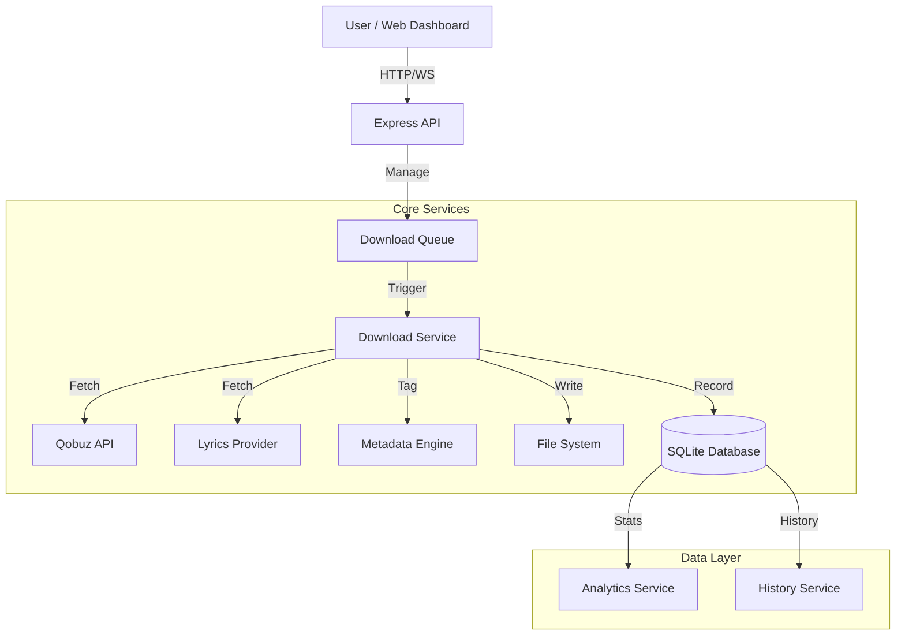

<div align="center">

# 🎵 QBZ-Downloader
### *The Ultimate High-Resolution Audio Downloader & Library Manager*

[](https://github.com/ifauzeee/QBZ-Downloader/releases)
[](https://nodejs.org/)
[](https://www.typescriptlang.org/)
[](https://www.docker.com/)
[](LICENSE)

<br/>

**Unlock the full potential of your music library.**  
Download studio-quality FLAC audio up to **24-bit/192kHz** with complete metadata, synchronized lyrics, and a beautiful web dashboard. Designed for audiophiles, data hoarders, and music lovers who demand perfection.

[✨ Features](#-features) •
[📥 Installation](#-installation) •
[⚙️ Configuration](#️-configuration) •
[🚀 Usage](#-usage) •
[📚 API Docs](#-api-documentation)

</div>

---

## 🌟 Overview

**QBZ-Downloader** is more than just a downloader script; it's a comprehensive music management system. It bridges the gap between streaming convenience and archival quality, offering a seamless way to download, tag, and organize music from Qobuz.

Built with **TypeScript** and **Modern Web Technologies** (Express, Socket.IO, SQLite), it features a robust backend capable of handling complex queues, batch operations, and a responsive frontend for easy management.

### Why Choose QBZ-Downloader?

*   **Bit-Perfect Audio**: We don't transcode. You get exactly what Qobuz streams, from CD Quality (16-bit/44.1kHz) to Hi-Res Studio Masters (24-bit/192kHz).
*   **Library Management**: Unlike simple script downloaders, QBZ-Downloader tracks your library context. It detects duplicates, manages artist discographies, and maintains a local database of your collection.
*   **Visual Interaction**: A full Web Dashboard allows you to search the catalog, preview tracks with generated waveforms, and manage your download queue visually.

---

## ✨ Features

### 🎧 **Audiophile Grade Audio Engine**
*   **Hi-Res Max**: Downloads FLAC up to **24-bit / 192kHz**.
*   **Smart Fallback**: Automatically attempts lower qualities (96kHz -> 44.1kHz) if your preferred quality is unavailable.
*   **Format Selection**: Support for MP3 (320kbps) and FLAC (Lossless/Hi-Res).
*   **Stream Preview**: Listen to tracks directly in the dashboard before downloading.

### 📝 **Advanced Metadata & Tagging**
*   **Standard Tags**: Title, Artist, Album, Album Artist, Year, Track Number, Disc Number.
*   **Rich Metadata**: Genre, Label, Copyright, ISRC, UPC, Barcode, Catalog Number.
*   **Credits**: Detailed credit tags (Composer, Producer, Engineer, Mixer, Lyricist).
*   **Album Art**: Embeds high-resolution cover art and saves `cover.jpg` in the album folder.
*   **Lyrics**: Fetches and embeds synchronized lyrics (USLT/SYLT) and saves external `.lrc` files.

### 💻 **Modern Web Dashboard**
*   **Real-Time Queue**: WebSocket-powered progress bars for download speed, file size, and status.
*   **Waveform Visualization**: Visual representation of audio tracks in the preview player.
*   **Search**: Full catalog search for Artists, Albums, Tracks, and Playlists.
*   **Analytics Dashboard**: View download trends, quality distribution (Pie Charts), and top artists.
*   **Multi-Language**: Fully localized interface in 7 languages:
    *   🇺🇸 English (en)
    *   🇮🇩 Bahasa Indonesia (id)
    *   🇪🇸 Español (es)
    *   🇫🇷 Français (fr)
    *   🇩🇪 Deutsch (de)
    *   🇯🇵 日本語 (ja)
    *   🇨🇳 中文 (zh)

### 🛠️ **Power User Tools**
*   **Batch Import**: Import hundreds of URLs via text file or clipboard.
*   **Artist Discography**: Download an artist's entire release history with one click.
*   **Playlist Watching**: (Coming Soon) Automatically download new tracks added to watched playlists.
*   **Duplicate Detection**: Database-backed scanning to prevent downloading the same track twice.
*   **Robust Error Handling**: Automatic retry logic with exponential backoff for network issues.

---

## 📸 Screenshots

<div align="center" style="margin: 40px 0;">
  <div style="background-color: #1a1b26; color: #a9b1d6; padding: 60px; border-radius: 12px; border: 2px dashed #30364c; text-align: center;">
    <h3 style="margin-top: 0;">🚧 Dashboard V3 Visual Preview 🚧</h3>
    <p>We are currently finalizing the new UI design. Live screenshots will appear here in the next update.</p>
    <br/>
    <p><i><b>Features to be showcased:</b><br/>Dark Mode Interface • Waveform Player • Analytics Charts</i></p>
  </div>
</div>

---

## 📥 Installation

### Option A: 🐳 Docker (Recommended)

The easiest way to get up and running, ensuring all dependencies and the environment are consistent.

```bash
# 1. Clone the repository
git clone https://github.com/ifauzeee/QBZ-Downloader.git
cd QBZ-Downloader

# 2. Configure your credentials (see Configuration section)
cp .env.example .env

# 3. Launch the container
docker-compose up -d
```

Access the dashboard at `http://localhost:3000`.

### Option B: 🛠️ Manual Setup

For developers or those who prefer running directly on the host machine.

**Prerequisites:**
*   Node.js v22.0.0 or higher
*   NPM or PNPM

```bash
# 1. Install dependencies
npm ci

# 2. Configure environment
cp .env.example .env
# Edit .env with your favorite text editor

# 3. Build the backend and frontend
npm run build

# 4. Start the application
npm start
```

---

## ⚙️ Configuration

The application is configured using a `.env` file in the root directory.

### 🔑 Authentication (Required)
You **must** provide your Qobuz account credentials. These can be obtained by inspecting network traffic on `play.qobuz.com`.

| Variable | Description | Required |
|----------|-------------|:--------:|
| `QOBUZ_APP_ID` | Your Qobuz Application ID (`x-app-id`) | ✅ |
| `QOBUZ_APP_SECRET` | Your Qobuz App Secret (found in bundle.js or main.js) | ✅ |
| `QOBUZ_USER_AUTH_TOKEN` | User Token (`x-user-auth-token`) | ✅ |
| `QOBUZ_USER_ID` | Your User ID (numeric) | ✅ |

### 📁 File Management

| Variable | Default | Description |
|----------|---------|-------------|
| `DOWNLOADS_PATH` | `./downloads` | Root directory for downloads. |
| `FOLDER_TEMPLATE` | `{albumArtist}/{album}` | Structuring logic for folders. |
| `FILE_TEMPLATE` | `{track_number}. {title}` | Naming logic for files. |
| `COVER_SIZE` | `max` | Resolution for artwork (`max`, `large`, `medium`). |

**Supported Template Variables:**
*   `{artist}`, `{albumArtist}`, `{album}`, `{title}`
*   `{track_number}`, `{disc_number}`, `{year}`, `{genre}`, `{quality}`

### ⬇️ Download Settings

| Variable | Default | Description |
|----------|---------|-------------|
| `DEFAULT_QUALITY` | `27` | `27` (192kHz), `7` (96kHz), `6` (44.1kHz), `5` (MP3). |
| `MAX_CONCURRENCY` | `2` | Number of simultaneous downloads. |
| `RETRY_ATTEMPTS` | `3` | Retries on network failure. |
| `RETRY_DELAY` | `1000` | Delay (ms) between retries. |

### 🎨 Dashboard & Metadata

| Variable | Default | Description |
|----------|---------|-------------|
| `DASHBOARD_PORT` | `3000` | Web server port. |
| `DASHBOARD_PASSWORD` | *(empty)* | Optional password protection. |
| `EMBED_LYRICS` | `true` | Embed lyrics into file tags. |
| `SAVE_LRC_FILE` | `true` | Create `.lrc` file alongside audio. |
| `SAVE_COVER_FILE` | `true` | Create `cover.jpg` file. |

---

## 🚀 Usage Guide

### Using the Dashboard

1.  **Search & Queue**:
    *   Navigate to **Search** in the sidebar.
    *   Type an artist or album name.
    *   Click the **Download** button on any card.
    *   The item moves to the **Queue** tab and starts processing.

2.  **Paste URL**:
    *   Copy a URL from the remote web player (e.g., `https://open.qobuz.com/album/abcdef`).
    *   Paste it into the input box on the dashboard home page.
    *   Hit Enter.

3.  **Batch Import**:
    *   Click the **Batch** icon.
    *   Paste a list of URLs (one per line).
    *   The system will validate them and add valid ones to the queue.

### File Organization
By default, your files will be organized as:
```
downloads/
  └── Artist Name/
      └── Album Title/
          ├── 01. Track Title.flac
          ├── 02. Track Title.flac
          ├── cover.jpg
          └── 01. Track Title.lrc
```

---

## 📚 API Documentation

For developers who want to integrate QBZ-Downloader into other tools, we offer a REST API.

### **Queue Operations**

*   **`GET /api/queue`**
    *   Returns the current active download queue.
*   **`POST /api/queue/add`**
    *   Body: `{ "url": "...", "quality": 27 }`
    *   Adds an item to the queue.
*   **`POST /api/queue/action`**
    *   Body: `{ "action": "pause" | "resume" | "clear" }`
    *   Controls the global queue state.

### **Library & History**

*   **`GET /api/history`**
    *   Returns list of all completed downloads.
*   **`GET /api/history/export`**
    *   Query: `?format=json|csv`
    *   Downloads the history as a file.
*   **`GET /api/statistics`**
    *   Returns aggregate stats (Total downloaded, Total bytes, etc.).

### **Search & Metadata**

*   **`GET /api/search`**
    *   Query: `?query=...&type=albums|artists|tracks`
*   **`GET /api/artist/:id`**
    *   Returns detailed artist info and albums buffer.
*   **`GET /api/album/:id`**
    *   Returns album tracklist and metadata.

### **Stream & Preview**

*   **`GET /api/stream/:id`**
    *   Redirects to the raw audio stream URL (valid for 1 minute).
*   **`GET /api/preview/:id/waveform`**
    *   Returns JSON array of waveform data points for visualization.

---

## 🏗️ Project Architecture



### Directory Structure

```text
/
├── data/               # SQLite database & History JSON
├── downloads/          # Default download directory
├── src/
│   ├── api/            # Qobuz & Lyrics API wrappers
│   ├── services/       # Core business logic
│   │   ├── dashboard/  # Web server routes
│   │   ├── database/   # Better-SQLite3 implementation
│   │   ├── download.ts # Main download logic
│   │   └── metadata.ts # Tagging logic
│   ├── types/          # TypeScript definitions
│   └── utils/          # Helpers (Encryption, Logger)
├── package.json        # Dependencies
└── docker-compose.yml  # Container setup
```

---

## ❓ Troubleshooting

**Q: I get "401 Unauthorized" errors.**
> A: Your Qobuz token has likely expired. Visit the web player, log out and log back in, then copy the new `x-user-auth-token` to your `.env` file.

**Q: Hi-Res tracks (192kHz) are downloading as 44.1kHz.**
> A: This usually happens if:
> 1. You don't have a **Studio** or **Sublime** subscription.
> 2. The specific album is not available in Hi-Res in your region.
> 3. Your token is associated with a free account.

**Q: Can I run this on a Raspberry Pi?**
> A: Yes! The Docker image supports `linux/arm64`. Just ensure you have decent storage write speeds for Hi-Res files.


## 🌍 Localization

We want QBZ-Downloader to be accessible to everyone. The dashboard is currently translated into 7 languages. 

**Want to add your language?**
1. Fork the repo.
2. Open `src/services/i18n.ts`.
3. Add your language code to the `Locale` type.
4. Add your translations to the `translations` object.
5. Create a Pull Request!

---

## 🤝 Contributing

We welcome contributions! Please follow these steps:

1.  **Fork** the repo.
2.  **Create a branch**: `git checkout -b feature/cool-new-thing`.
3.  **Commit changes**: `git commit -m 'Add cool new thing'`.
4.  **Push**: `git push origin feature/cool-new-thing`.
5.  **Open a Pull Request**.

**Development Commands:**
*   `npm run dev`: Transpile & run in watch mode.
*   `npm test`: Run the Vitest test suite.
*   `npm run lint`: Check code style.

---

## 📜 License

This project is licensed under the **MIT License**.

> **Disclaimer**: This tool is for educational and archival purposes only. You must possess a valid Qobuz subscription to use it. The developers are not responsible for copyright infringement or misuse of this software.

---

<div align="center">

**Made with ❤️ by [ifauzeee](https://github.com/ifauzeee)**

⭐ Star this repo if you find it useful!

</div>