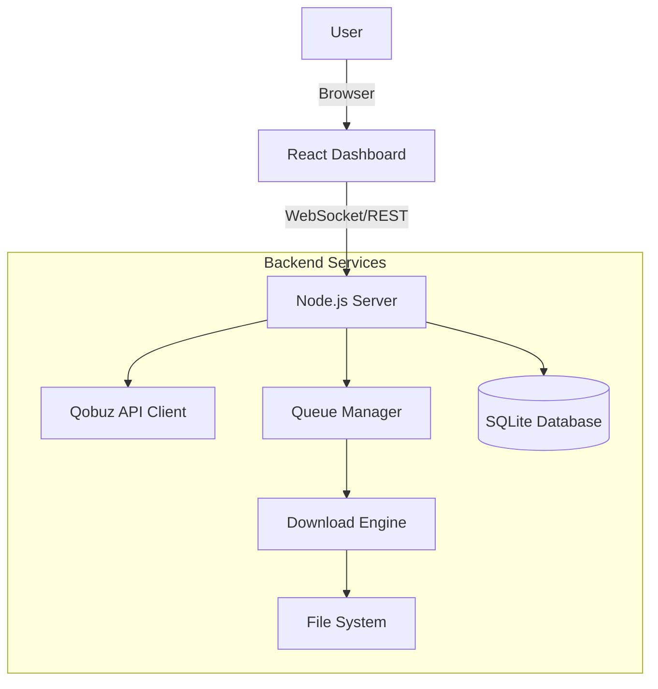

<div align="center">

# 🎵 QBZ-Downloader
### *The Ultimate High-Resolution Audio Downloader & Library Manager*

[](https://github.com/ifauzeee/QBZ-Downloader/releases)
[](https://react.dev/)
[](https://www.typescriptlang.org/)
[](https://nodejs.org/)
[](https://www.docker.com/)
[](LICENSE)

<br/>


<br/>

**Unlock the full potential of your music library.**

A comprehensive, enterprise-grade music downloading and library management platform. Experience studio-quality audio up to **24-bit/192kHz** with complete metadata, synchronized lyrics, intelligent queue management, and a stunning real-time web dashboard.

[✨ Features](#-key-features) •
[📥 Installation](#-installation) •
[⚙️ Configuration](#-configuration) •
[🚀 Usage](#-usage-guide) •
[📸 Screenshots](#-interface-showcase)

</div>

> [!IMPORTANT]
> **This application uses the Qobuz API but is not certified by, endorsed by, or affiliated with Qobuz.**

---

## ✨ Key Features

Everything you need to build the perfect local music library.

| Feature | Description |
| :--- | :--- |
| **🎵 Studio Quality** | Download in **Hi-Res FLAC (up to 24-bit/192kHz)**. Bit-perfect replicas of the source. |
| **🖥️ Modern Dashboard** | Beautiful **React & Vite** interface with **Light/Dark Mode**, real-time updates, and smooth animations. |
| **🎤 Live Lyrics** | Experience synchronized lyrics with **60fps smooth scrolling**. Includes a built-in **Lyrics Editor**. |
| **🏷️ Smart Tagging** | Automatic tagging with **High-Res Cover Art**, Artist, Album, Year, Genre, ISRC, and more. |
| **📦 Batch Power** | Download **Full Albums**, **Artist Discographies**, or **Playlists** with a single click. |
| **📚 Library Manager** | Scans your library to **detect duplicates**, identify missing metadata, and suggest upgrades. |
| **🎼 Visualizer** | Built-in real-time audio visualization for an immersive listening experience. |
| **📊 Analytics** | Visualize your collection with charts: quality distribution, top artists, and storage mastery. |
| **🐳 Docker Ready** | Deploy effortlessly with Docker. Keeps your system clean and secure. |

---

## 📸 Interface Showcase

Explore the beautiful, functional interface of QBZ-Downloader.

### 🔍 Discovery & Search
Quickly find your music with our optimized search engine.
<div align="center">
  
  
  
</div>

### 👤 Deep Metadata Exploration
Dive into detailed artist biographies and album credits.
<div align="center">
  
  
</div>

### 📥 Download Management
Track your downloads with precision and history.
<div align="center">
  
  
</div>

### 📚 Library Tools
Keep your collection pristine.
<div align="center">
  
  
  
</div>

<div align="center">
  <br/>
  <a href="https://ifauzeee.vercel.app/projects/qbz-downloader/preview">
    
  </a>
</div>

---

## 📥 Installation

### Option A: 🐳 Docker (Recommended)
The easiest way to get started.

```bash
# 1. Clone repository
git clone https://github.com/ifauzeee/QBZ-Downloader.git
cd QBZ-Downloader

# 2. Setup environment
cp .env.example .env
# Edit .env with your Qobuz credentials

# 3. specific Build and run
docker-compose up -d

# 4. Open http://localhost:3000
```

### Option B: 🛠️ Manual Setup

```bash
# 1. Clone
git clone https://github.com/ifauzeee/QBZ-Downloader.git
cd QBZ-Downloader

# 2. Install & Build
npm install
npm run build:full

# 3. Configure
cp .env.example .env

# 4. Start
npm start
```

---

## ⚙️ Configuration

Create a `.env` file in the root directory.

### 🔑 Authentication (Required)
You must provide valid Qobuz credentials.

```properties
# Your application credentials
QOBUZ_APP_ID=your_app_id
QOBUZ_APP_SECRET=your_app_secret

# Your user token (get this from your browser cookies/local storage)
QOBUZ_USER_AUTH_TOKEN=your_user_token
QOBUZ_USER_ID=your_user_id
```

### 📁 Preferences
```properties
# Downloads
DOWNLOADS_PATH=./downloads
FOLDER_TEMPLATE={albumArtist}/{album}
FILE_TEMPLATE={track_number}. {title}

# Metadata
EMBED_COVER_ART=true
SAVE_COVER_FILE=true
COVER_SIZE=max
```

---

## 🏗️ System Architecture



---

## ⚖️ Legal Disclaimer

**Educational Use Only**
This software is provided specifically for educational and personal archival purposes.

1.  **No Bypass**: This tool does not bypass DRM or region restrictions. It interacts with the API using your own valid credentials.
2.  **Trademarks**: "Qobuz" is a registered trademark of Xandrie SA. This project is not affiliated with Xandrie SA.
3.  **Responsibility**: Users are solely responsible for their actions and must comply with Qobuz's Terms of Service.

---

<div align="center">
  Made with ❤️ by <b>Muhammad Ibnu Fauzi</b>
</div>
