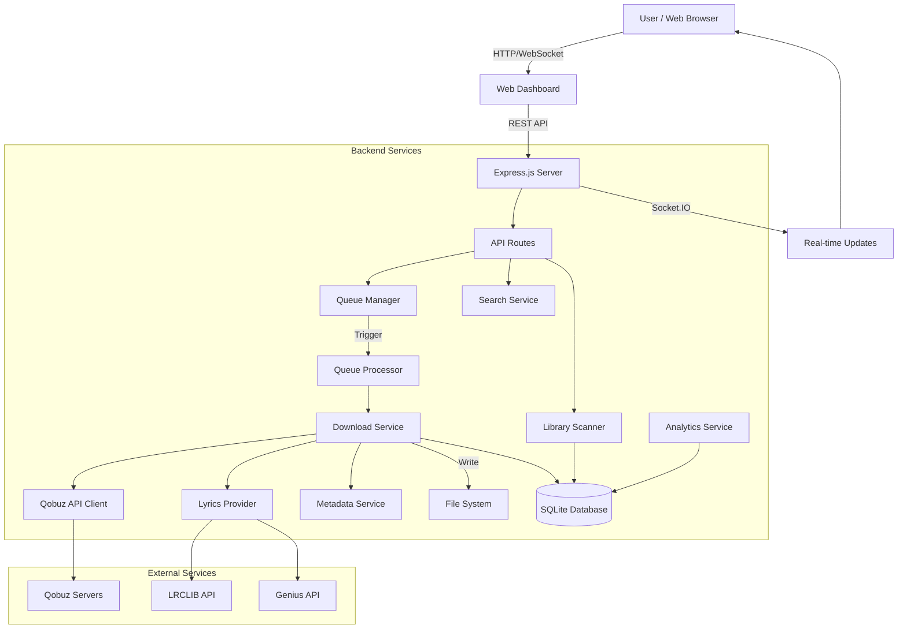

<div align="center">

# 🎵 QBZ-Downloader

### *The Ultimate High-Resolution Audio Downloader & Library Management Platform*

[](https://github.com/ifauzeee/QBZ-Downloader/releases)
[](https://nodejs.org/)
[](https://www.typescriptlang.org/)
[](https://expressjs.com/)
[](https://socket.io/)
[](https://www.sqlite.org/)
[](https://www.docker.com/)
[](LICENSE)

<br/>


<br/>

**Unlock the full potential of your music library.**

A comprehensive, enterprise-grade music downloading and library management platform that delivers studio-quality FLAC audio up to **24-bit/192kHz** with complete metadata tagging, synchronized lyrics embedding, intelligent queue management, advanced analytics, and a beautiful real-time web dashboard. Designed for audiophiles, music archivists, and enthusiasts who demand nothing but perfection.

[✨ Features](#-comprehensive-feature-overview) •
[📥 Installation](#-installation) •
[⚙️ Configuration](#️-configuration) •
[🚀 Usage](#-usage-guide) •
[📚 API Docs](#-api-documentation) •
[🏗️ Architecture](#️-system-architecture)

</div>

---

## 📋 Table of Contents

1. [Overview](#-overview)
2. [Why QBZ-Downloader?](#-why-qbz-downloader)
3. [Comprehensive Feature Overview](#-comprehensive-feature-overview)
   - [Audio Engine](#-audiophile-grade-audio-engine)
   - [Metadata & Tagging](#-advanced-metadata--tagging-system)
   - [Web Dashboard](#-modern-web-dashboard)
   - [Queue Management](#-intelligent-queue-management)
   - [Library Scanner](#-library-scanner--management)
   - [Analytics](#-analytics--insights)
   - [Multi-Language Support](#-internationalization-i18n)
   - [Notification System](#-real-time-notification-system)
   - [Security](#-security-features)
4. [Screenshots](#-screenshots)
5. [Installation](#-installation)
6. [Configuration](#️-configuration)
7. [Usage Guide](#-usage-guide)
8. [API Documentation](#-api-documentation)
9. [System Architecture](#️-system-architecture)
10. [Technology Stack](#-technology-stack)
11. [Troubleshooting](#-troubleshooting)
12. [Contributing](#-contributing)
13. [License & Disclaimer](#-license--disclaimer)

---

## 🌟 Overview

**QBZ-Downloader** is a comprehensive high-resolution audio downloading and music management platform. It is more than just a standard downloader script — it is a complete music management system with enterprise-grade features.

Built with **TypeScript** and modern web technologies (Express.js 5.x, Socket.IO, SQLite with Better-SQLite3), this platform combines a powerful backend with a responsive frontend to provide a seamless music management experience.

### Development Philosophy

```
🎯 Bit-Perfect Audio  →  No transcoding, original quality preserved
📊 Data-Driven        →  SQLite database for comprehensive tracking & analytics
⚡ Real-Time          →  WebSocket for instant progress updates
🔒 Secure by Design   →  Input validation, XSS protection, rate limiting
🌍 Globally Accessible →  Multi-language interface (7 languages)
```

---

## 💡 Why QBZ-Downloader?

| Feature | QBZ-Downloader | Other Scripts |
|-------|:--------------:|:-----------:|
| **Hi-Res Audio (192kHz)** | ✅ | ⚠️ Limited |
| **Web Dashboard** | ✅ Real-time | ❌ CLI only |
| **Database Tracking** | ✅ SQLite | ❌ |
| **Duplicate Detection** | ✅ Intelligent | ❌ |
| **Library Scanner** | ✅ Deep scan + upgrade detection | ❌ |
| **Analytics Dashboard** | ✅ Charts & insights | ❌ |
| **Synchronized Lyrics** | ✅ LRC + Embedded | ⚠️ Limited |
| **Multi-Language** | ✅ 7 languages | ❌ English only |
| **Docker Support** | ✅ Multi-stage build | ⚠️ Basic |
| **REST API** | ✅ Complete | ❌ |
| **WebSocket Updates** | ✅ Real-time | ❌ |
| **Error Recovery** | ✅ Retry + Resume | ⚠️ Basic |
| **Batch Import** | ✅ TXT, CSV, Clipboard | ⚠️ Limited |
| **Artist Discography** | ✅ One-click | ❌ |

---

## ✨ Comprehensive Feature Overview

### 🎧 Audiophile-Grade Audio Engine

QBZ-Downloader provides an uncompromising audio experience with an optimized download engine.

#### Supported Formats & Quality

| Format ID | Quality | Bit Depth | Sample Rate | Extension | Emoji |
|:---------:|:---------|:---------:|:-----------:|:---------:|:-----:|
| `27` | **FLAC Hi-Res Max** | 24-bit | 192kHz | `.flac` | 🔥 |
| `7` | FLAC Hi-Res | 24-bit | 96kHz | `.flac` | ✨ |
| `6` | FLAC CD Quality | 16-bit | 44.1kHz | `.flac` | 💿 |
| `5` | MP3 High Quality | - | 320kbps | `.mp3` | 🎵 |

#### Audio Engine Features

- **Bit-Perfect Download**: Audio is downloaded exactly as streamed without transcoding
- **Smart Quality Fallback**: Automatically tries lower quality if preference is unavailable (192k → 96k → 44.1k)
- **Stream Preview**: Listen to track previews directly on the dashboard before downloading
- **Waveform Visualization**: Visual representation of the audio track for easy navigation
- **Concurrent Downloads**: Configure the number of parallel downloads (default: 2)
- **Retry Logic**: Exponential backoff with automatic retry on network errors
- **Resume Capability**: Resume interrupted downloads from the last position

#### Download Service Code

```typescript
// Support for downloading Track, Album, Playlist, and Artist
class DownloadService {
    downloadTrack(trackId: string, quality = 27): Promise<DownloadResult>
    downloadAlbum(albumId: string, quality = 27): Promise<DownloadResult>
    downloadPlaylist(playlistId: string, quality = 27): Promise<DownloadResult>
    downloadArtist(artistId: string, quality = 27): Promise<DownloadResult>
}
```

---

### 📝 Advanced Metadata & Tagging System

The most comprehensive metadata system to ensure your music collection is perfectly organized.

#### Tag Categories

**Basic Tags (Always embedded)**
- `title` - Track title
- `artist` - Main artist name
- `album` - Album name
- `year` - Release year
- `trackNumber` - Track number in album
- `genre` - Music genre

**Extended Tags**
| Category | Tags |
|----------|------|
| **Artist Info** | `albumArtist`, `performer`, `composers` |
| **Album Info** | `discNumber`, `totalDiscs`, `totalTracks`, `releaseType` |
| **Production** | `producer`, `mixer`, `engineer`, `masteredBy` |
| **Release Info** | `label`, `copyright`, `catalogNumber` |
| **Identifiers** | `isrc`, `upc`, `barcode` |
| **Additional** | `bpm`, `key`, `mood`, `country`, `language` |

**Credits Tags**
- `composer` - Songwriter
- `lyricist` - Lyricist
- `conductor` - Conductor (for classical music)
- `orchestra` - Orchestra
- `ensemble` - Music ensemble

#### Album Artwork

| Size | Resolution | Usage |
|------|----------|------------|
| `max` | 600x600+ | Cover.jpg saved |
| `mega` | 3000x3000 | Hi-res artwork |
| `extralarge` | 600x600 | Embedded in file |
| `large` | 600x600 | Fallback |
| `medium` | 300x300 | Thumbnail |
| `small` | 150x150 | Preview |

#### Lyrics Processing

```typescript
class LyricsProvider {
    // Multi-provider with fallback
    providers: ['LRCLIB', 'Genius']
    
    // Supported formats
    - Synchronized lyrics (with timestamp)
    - Plain lyrics (text only)
    - Separate LRC file (.lrc)
    - Embedded USLT/SYLT tags
}
```

**Lyrics Features:**
- 🎤 **LRCLIB Integration**: Main provider for synced lyrics
- 🌟 **Genius Fallback**: Fallback to Genius if LRCLIB is unavailable
- 📄 **External LRC Files**: Save `.lrc` files alongside audio
- 🔤 **Embedded Lyrics**: Lyrics embedded directly into audio files
- 🎵 **Synced Playback**: Support for synchronized lyrics playback

---

### 💻 Modern Web Dashboard

A modern and responsive web dashboard with UI/UX designed for maximum productivity.

#### Pages & Components

| Page | Features |
|---------|-------|
| **Home** | Quick paste URL, summary stats, latest notifications |
| **Search** | Search albums, tracks, artists, playlists with preview |
| **Queue** | Real-time queue with per-item progress bar |
| **History** | Download history with filter and sort |
| **Analytics** | Interactive charts, download trends, top artists |
| **Library** | Scan library, detect duplicates, upgrade finder |
| **Settings** | Configure credentials, folders, quality |

#### Real-Time Features

```javascript
// Socket.IO Events
socket.on('queue:item:added')      // New item added
socket.on('queue:item:started')    // Download started
socket.on('queue:item:progress')   // Progress update
socket.on('queue:item:completed')  // Download completed
socket.on('queue:item:failed')     // Download failed
socket.on('notification')          // New notification
```

#### Dashboard Technology

- **Frontend**: Vanilla JS + CSS with modern features
- **Real-time**: Socket.IO for WebSocket communication
- **Charts**: Dynamic charts for analytics visualization
- **PWA Ready**: Service Worker and Web Manifest
- **Responsive**: Optimized for desktop and mobile

---

### 🔄 Intelligent Queue Management

A powerful queue system with priority, retry logic, and state management.

#### Queue Status

| Status | Description | Icon |
|--------|-----------|------|
| `pending` | Waiting to be processed | ⏳ |
| `downloading` | Downloading | ⬇️ |
| `processing` | Tagging metadata | ⚙️ |
| `completed` | Success | ✅ |
| `failed` | Failed | ❌ |
| `cancelled` | Cancelled | 🚫 |

#### Queue Features

```typescript
class DownloadQueue {
    // Basic operations
    add(type, contentId, quality, options): QueueItem
    getNext(): QueueItem | null
    cancel(id): boolean
    remove(id): boolean
    
    // Queue control
    pause(): void
    resume(): void
    clear(): number
    clearCompleted(): number
    clearPending(): number
    
    // Priority
    priority: 'low' | 'normal' | 'high'
    
    // Event-driven
    on('item:added' | 'item:completed' | 'queue:empty', callback)
}
```

#### Error Handling & Retry

```typescript
enum ErrorCategory {
    NETWORK = 'network',     // Retry with backoff
    AUTH = 'auth',           // No retry, new token needed
    NOT_FOUND = 'not_found', // No retry
    RATE_LIMIT = 'rate_limit', // Retry with longer delay
    SERVER = 'server',       // Retry with backoff
    UNKNOWN = 'unknown'      // Limited retry
}
```

---

### 📚 Library Scanner & Management

Manage your local music collection with a powerful library scanner.

#### Scan Features

| Feature | Description |
|-------|-----------|
| **Deep Scan** | Recursive scan of all directories |
| **Format Detection** | FLAC, MP3, WAV, AIFF, ALAC, M4A, OGG |
| **Metadata Extraction** | Read metadata from audio files |
| **Quality Analysis** | Content bit depth and sample rate analysis |
| **Duplicate Detection** | Identify duplicate files |
| **Upgrade Finder** | Find tracks available for upgrade to Hi-Res |

#### Library File Analysis

```typescript
interface LibraryFile {
    filePath: string
    trackId?: string      // Linked Qobuz track ID
    title: string
    artist: string
    album: string
    duration: number
    quality: number
    availableQuality?: number  // Highest available quality
    fileSize: number
    format: 'flac' | 'mp3' | 'wav' | ...
    bitDepth: number
    sampleRate: number
    needsUpgrade: boolean // Flag if higher quality is available
}
```

#### Duplicate Detection Algorithm

```typescript
// Match types
type MatchType = 'exact' | 'similar' | 'remaster'

interface DuplicateGroup {
    id: number
    files: Array<{path, size, quality}>
    matchType: MatchType
    recommendation: string  // "Keep highest quality"
}

// Levenshtein distance for similarity matching
similarity(str1, str2): number  // 0.0 - 1.0
```

---

### 📊 Analytics & Insights

Comprehensive analytics dashboard to understand your download patterns and collection.

#### Available Statistics

**Overall Statistics**
- Total downloads
- Total tracks/albums/playlists
- Total library size
- Average downloads per day
- First/last download date

**Trend Analysis**
- Daily download trends (30 days)
- Weekly trends
- Monthly trends  
- Growth percentage

**Distribution Charts**
- Quality distribution (Pie chart)
- Genre breakdown
- Format distribution
- Storage by quality

**Artist Insights**
```typescript
interface ArtistInsight {
    name: string
    trackCount: number
    albumCount: number
    totalSize: number
    averageQuality: number
    imageUrl?: string
    firstDownload: string
    lastDownload: string
}
```

#### Generated Insights

System automatically generates insights such as:
- "🔥 You've downloaded 150 tracks this month - 25% more than last month!"
- "✨ 78% of your library is Hi-Res quality (24-bit)"
- "🎸 Rock is your most downloaded genre with 45 tracks"
- "⚡ Your library has grown 2.5GB this week"

---

### 🌍 Internationalization (i18n)

Dashboard is available in 7 languages for global accessibility.

| Language | Code | Flag |
|----------|------|------|
| English | `en` | 🇺🇸 |
| Bahasa Indonesia | `id` | 🇮🇩 |
| Español | `es` | 🇪🇸 |
| Français | `fr` | 🇫🇷 |
| Deutsch | `de` | 🇩🇪 |
| 日本語 | `ja` | 🇯🇵 |
| 中文 | `zh` | 🇨🇳 |

#### Translation Coverage

- UI Labels & buttons
- Error messages
- Success notifications
- Tooltips & hints
- Empty states
- Form validations

#### Adding a New Language

```typescript
// 1. Add locale code
type Locale = 'en' | 'id' | 'es' | 'fr' | 'de' | 'ja' | 'zh' | 'YOUR_LOCALE';

// 2. Add translations
const translations: Record<Locale, TranslationSet> = {
    'your_locale': {
        appName: 'QBZ-Downloader',
        loading: 'Your Loading Text',
        // ... 50+ other keys
    }
}
```

---

### 🔔 Real-Time Notification System

Event-driven notification system for tracking all activities.

#### Notification Types

| Type | Usage | Color |
|------|------------|-------|
| `success` | Download completed, import successful | 🟢 Green |
| `error` | Download failed, token expired | 🔴 Red |
| `warning` | Partial success, quality fallback | 🟡 Yellow |
| `info` | Queue empty, scan complete | 🔵 Blue |

#### Built-in Notification Functions

```typescript
// Globally available
notifyDownloadComplete(title, filePath)
notifyDownloadError(title, error)
notifyBatchComplete(imported, failed)
notifyTokenExpired()
notifyQueueEmpty()
```

#### Notification Features

- 📬 Unread count badge
- 🔔 Real-time push via Socket.IO
- 📋 Notification history
- ✅ Mark as read / Mark all as read
- 🗑️ Delete individual notifications
- 📱 Browser notification support (upcoming)

---

### 🔒 Security Features

QBZ-Downloader is built with security as a priority.

#### Input Validation

```typescript
class InputValidator {
    // URL validation with pattern matching
    validateUrl(url): UrlValidationResult
    
    // Query sanitization
    validateQuery(query): QueryValidationResult
    
    // Quality validation
    validateQuality(quality): boolean
    
    // ID validation
    isValidId(id): boolean
    
    // XSS protection
    sanitizeForDisplay(str): string
}

// Blocked dangerous patterns
const DANGEROUS_PATTERNS = [
    /<script/i,
    /javascript:/i,
    /data:/i,
    /vbscript:/i,
    /on\w+\s*=/i,
    /&#/,
    /%3C/i,
    /%3E/i
]
```

#### Additional Security

- **Rate Limiting**: Express rate limiter for API endpoints
- **CORS Configuration**: Configurable CORS settings
- **Environment Isolation**: Credentials in environment variables
- **Non-root Docker**: Container runs as non-root user
- **Input Length Limits**: Maximum URL (500) and query (200) characters

---

## 📸 Screenshots

<div align="center" style="margin: 40px 0;">

## **Coming Soon**

</div>

---

## 📥 Installation

### System Requirements

| Requirement | Minimum | Recommended |
|-------------|---------|-------------|
| **Node.js** | v18.0.0 | v22.0.0+ |
| **NPM** | v9.0.0 | v10.0.0+ |
| **RAM** | 512MB | 1GB+ |
| **Storage** | As needed | SSD recommended |
| **OS** | Windows/macOS/Linux | Any |

### Option A: 🐳 Docker (Recommended)

Docker provides a consistent and easy-to-maintain environment.

```bash
# 1. Clone repository
git clone https://github.com/ifauzeee/QBZ-Downloader.git
cd QBZ-Downloader

# 2. Setup environment file
cp .env.example .env
# Edit .env with your credentials

# 3. Build and run with Docker Compose
docker-compose up -d

# 4. View logs
docker-compose logs -f qbz-web
```

Dashboard is available at `http://localhost:3000`

#### Docker Configuration

```yaml
# docker-compose.yml
services:
  qbz-web:
    build: .
    container_name: qbz-web
    restart: unless-stopped
    env_file: .env
    volumes:
      - ./downloads:/app/downloads  # Download folder
      - ./data:/app/data            # Database & history
    ports:
      - "3000:3000"
```

#### Docker Features

- **Multi-stage Build**: Optimal image size
- **Non-root User**: Security best practice
- **Health Check**: Auto-restart if unhealthy
- **Volume Persistence**: Data saved on host
- **ARM64 Support**: Compatible with Raspberry Pi

---

### Option B: 🛠️ Manual Setup

For development or preference without Docker.

```bash
# 1. Clone repository
git clone https://github.com/ifauzeee/QBZ-Downloader.git
cd QBZ-Downloader

# 2. Install dependencies
npm ci

# 3. Setup environment
cp .env.example .env
# Edit .env with your favorite text editor

# 4. Build TypeScript
npm run build

# 5. Run application
npm start
```

#### Development Mode

```bash
# Watch mode for development
npm run dev

# Run test suite
npm test

# Test with coverage
npm run test:coverage

# Linting
npm run lint
npm run lint:fix

# Format code
npm run format
```

---

## ⚙️ Configuration

All configuration is done via the `.env` file in the root directory.

### 🔑 Authentication (Required)

Mandatory credentials to access Qobuz API.

```env
# App credentials (from browser developer tools)
QOBUZ_APP_ID=your_app_id
QOBUZ_APP_SECRET=your_app_secret

# User credentials
QOBUZ_USER_AUTH_TOKEN=your_user_token
QOBUZ_USER_ID=your_user_id
```

#### How to Get Credentials

1. Open `https://play.qobuz.com` and login
2. Open Developer Tools (F12) → Network tab
3. Search or play a track
4. Look for request to `api.json` and check headers:
   - `x-app-id` → `QOBUZ_APP_ID`
   - `x-user-auth-token` → `QOBUZ_USER_AUTH_TOKEN`
5. For `APP_SECRET`, check JavaScript files (bundle.js/main.js)

---

### 📁 File Management

```env
# Download path (relative or absolute)
DOWNLOADS_PATH=./downloads

# Template folder (available variables below)
FOLDER_TEMPLATE={albumArtist}/{album}

# File name template
FILE_TEMPLATE={track_number}. {title}

# Cover art size
COVER_SIZE=max  # max | large | medium | small
```

#### Template Variables

| Variable | Description | Example |
|----------|-----------|--------|
| `{artist}` | Track artist | "John Mayer" |
| `{albumArtist}` | Album artist | "Various Artists" |
| `{album}` | Album name | "Continuum" |
| `{title}` | Track title | "Gravity" |
| `{track_number}` | Track number (2-digits) | "03" |
| `{disc_number}` | Disc number | "1" |
| `{year}` | Release year | "2006" |
| `{genre}` | Genre | "Blues" |
| `{quality}` | Quality format | "24-192" |

#### Example Folder Structure Result

```
downloads/
└── John Mayer/
    └── Continuum (2006)/
        ├── 01. Waiting on the World to Change.flac
        ├── 02. I Don't Trust Myself (With Loving You).flac
        ├── 03. Belief.flac
        ├── 04. Gravity.flac
        ├── cover.jpg
        └── 04. Gravity.lrc
```

---

### ⬇️ Download Settings

```env
# Default Quality (27=192kHz, 7=96kHz, 6=44.1kHz, 5=MP3)
DEFAULT_QUALITY=27

# Number of parallel downloads
MAX_CONCURRENCY=2

# Retry settings
RETRY_ATTEMPTS=3
RETRY_DELAY=1000  # in milliseconds
```

---

### 🎨 Dashboard & Metadata

```env
# Dashboard settings
DASHBOARD_PORT=3000
DASHBOARD_PASSWORD=  # Empty = no password

# Auto cleanup history (in hours)
DASHBOARD_AUTO_CLEAN_HOURS=24

# Metadata embedding
EMBED_COVER_ART=true    # Embed cover into file
SAVE_COVER_FILE=true    # Save separate cover.jpg
EMBED_LYRICS=true       # Embed lyrics into file
SAVE_LRC_FILE=true      # Save separate .lrc
```

---

### 🔧 Advanced Settings

```env
# Streaming preview quality (for dashboard preview)
STREAMING_QUALITY=5  # MP3 for fast preview

# Proxy (if needed)
PROXY_URL=

# Debug logging
DEBUG=false
```

---

## 🚀 Usage Guide

### Using Web Dashboard

#### 1. Quick Download via URL

1. Copy URL from Qobuz web player
   - Album: `https://open.qobuz.com/album/abc123`
   - Track: `https://open.qobuz.com/track/xyz789`
   - Playlist: `https://open.qobuz.com/playlist/pl123`
   - Artist: `https://open.qobuz.com/interpreter/artist-name/123`

2. Paste into input box on Home page
3. Press Enter or click Download button
4. Monitor progress in Queue tab

#### 2. Search & Download

1. Navigate to **Search** page
2. Type artist, album, or track name
3. Select category: Albums, Tracks, Artists, Playlists
4. Click **Download** button on desired card
5. Item will be added to Queue

#### 3. Batch Import

Import multiple URLs at once:

**Via Dashboard:**
1. Click **Batch Import** icon
2. Paste list of URLs (one per line)
3. Click **Import**

**Via File:**
```text
# urls.txt
https://open.qobuz.com/album/abc123
https://open.qobuz.com/album/def456
https://open.qobuz.com/track/ghi789
```

**Via CSV:**
```csv
url,quality
https://open.qobuz.com/album/abc123,27
https://open.qobuz.com/album/def456,7
```

#### 4. Artist Discography

Download entire artist discography:
1. Search specifically for desired artist
2. Open artist detail page
3. Click **Download All Albums**
4. All albums will be queued

#### 5. Library Management

**Scan Library:**
1. Open **Library** page
2. Click **Scan Library**
3. Wait for scan process to complete
4. View results: total files, duplicates, upgradeable

**Resolve Duplicates:**
1. Click **View Duplicates**
2. Review each duplicate group
3. Select file to keep
4. Click **Resolve** to delete duplicates

**Upgrade Tracks:**
1. Click **Upgradeable Files**
2. View tracks available in higher quality
3. Click **Upgrade** to download Hi-Res version

---

## 📚 API Documentation

QBZ-Downloader provides a complete REST API for integration with other tools.

### Base URL

```
http://localhost:3000/api
```

### Endpoints Overview

| Method | Endpoint | Description |
|--------|----------|-----------|
| `GET` | `/status` | Server status and info |
| `GET` | `/queue` | List queue items |
| `POST` | `/queue/add` | Add item to queue |
| `POST` | `/queue/action` | Queue control (pause/resume/clear) |
| `GET` | `/history` | Download history |
| `GET` | `/history/export` | Export history (JSON/CSV) |
| `GET` | `/statistics` | Aggregate statistics |
| `GET` | `/search` | Catalog search |
| `GET` | `/album/:id` | Album detail |
| `GET` | `/track/:id` | Track detail |
| `GET` | `/artist/:id` | Artist detail |
| `GET` | `/stream/:id` | Stream URL (preview) |
| `GET` | `/notifications` | Notification list |

---

### Queue Operations

#### Get Queue
```http
GET /api/queue
```

**Response:**
```json
{
  "success": true,
  "items": [
    {
      "id": "q-123456",
      "type": "album",
      "contentId": "abc123",
      "quality": 27,
      "status": "downloading",
      "progress": 45,
      "title": "Album Name",
      "artist": "Artist Name",
      "addedAt": "2024-01-15T10:30:00Z"
    }
  ],
  "stats": {
    "total": 5,
    "pending": 2,
    "downloading": 1,
    "completed": 2,
    "failed": 0
  }
}
```

#### Add to Queue
```http
POST /api/queue/add
Content-Type: application/json

{
  "url": "https://open.qobuz.com/album/abc123",
  "quality": 27
}
```

**Response:**
```json
{
  "success": true,
  "item": {
    "id": "q-789012",
    "type": "album",
    "contentId": "abc123",
    "status": "pending"
  }
}
```

#### Queue Actions
```http
POST /api/queue/action
Content-Type: application/json

{
  "action": "pause" | "resume" | "clear"
}
```

---

### Search

```http
GET /api/search?query=john+mayer&type=albums&limit=20
```

**Parameters:**
| Param | Type | Required | Default | Values |
|-------|------|----------|---------|--------|
| `query` | string | Yes | - | Search term |
| `type` | string | No | albums | albums, tracks, artists |
| `limit` | number | No | 20 | 1-50 |
| `offset` | number | No | 0 | Pagination offset |

**Response:**
```json
{
  "success": true,
  "data": {
    "albums": {
      "items": [
        {
          "id": "abc123",
          "title": "Continuum",
          "artist": { "name": "John Mayer" },
          "hires": true,
          "tracks_count": 12
        }
      ]
    }
  }
}
```

---

### History & Export

#### Get History
```http
GET /api/history?limit=50&offset=0
```

#### Export History
```http
GET /api/history/export?format=json
GET /api/history/export?format=csv
```

---

### Statistics

```http
GET /api/statistics
```

**Response:**
```json
{
  "success": true,
  "data": {
    "overall": {
      "totalDownloads": 500,
      "totalTracks": 450,
      "totalAlbums": 50,
      "totalSize": 52428800000,
      "averagePerDay": 15
    },
    "byQuality": [
      { "quality": 27, "count": 300, "percentage": 60 },
      { "quality": 7, "count": 150, "percentage": 30 },
      { "quality": 6, "count": 50, "percentage": 10 }
    ],
    "topArtists": [...]
  }
}
```

---

### Stream & Preview

```http
GET /api/stream/:trackId
```

Returns redirect to temporary stream URL (valid 1 minute).

```http
GET /api/preview/:trackId/waveform
```

Returns JSON array of waveform data points.

---

## 🏗️ System Architecture

### High-Level Architecture



### Directory Structure

```
qbz-downloader/
├── 📁 data/                    # Runtime data
│   ├── qbz.db                 # SQLite database
│   ├── history.json           # Download history
│   └── resume.json            # Partial downloads
│
├── 📁 downloads/               # Downloaded files
│   └── {Artist}/{Album}/
│       ├── XX. Track.flac
│       ├── cover.jpg
│       └── XX. Track.lrc
│
├── 📁 src/                     # Source code
│   ├── 📁 api/                # External API clients
│   │   ├── qobuz.ts          # Qobuz API wrapper
│   │   └── lyrics.ts         # Lyrics providers
│   │
│   ├── 📁 services/           # Business logic
│   │   ├── 📁 analytics/     # Analytics engine
│   │   ├── 📁 audio-preview/ # Stream preview
│   │   ├── 📁 dashboard/     # Web server
│   │   │   ├── index.ts      # Server setup
│   │   │   ├── routes.ts     # API endpoints
│   │   │   ├── cleaner.ts    # Auto cleanup
│   │   │   └── 📁 public/    # Frontend assets
│   │   │       ├── index.html
│   │   │       ├── app.js
│   │   │       └── style.css
│   │   ├── 📁 database/      # SQLite wrapper
│   │   ├── 📁 library-scanner/ # Library management
│   │   ├── 📁 queue/         # Queue system
│   │   │   ├── queue.ts      # Queue manager
│   │   │   ├── types.ts      # Type definitions
│   │   │   └── utils.ts      # Helper functions
│   │   ├── batch.ts          # Batch import
│   │   ├── download.ts       # Download logic
│   │   ├── history.ts        # History tracking
│   │   ├── i18n.ts           # Translations
│   │   ├── metadata.ts       # Tagging engine
│   │   ├── notifications.ts  # Notification system
│   │   ├── queue-processor.ts # Queue execution
│   │   └── statistics.ts     # Stats aggregation
│   │
│   ├── 📁 types/              # TypeScript types
│   │   ├── qobuz.ts          # Qobuz types
│   │   ├── modules.d.ts      # Module declarations
│   │   └── flac-metadata.d.ts # FLAC types
│   │
│   ├── 📁 utils/              # Utilities
│   │   ├── cache.ts          # Simple cache
│   │   ├── encryption.ts     # Token handling
│   │   ├── env.ts            # Environment validation
│   │   ├── errors.ts         # Error classes
│   │   ├── friendly-errors.ts # User-friendly errors
│   │   ├── input.ts          # Input helpers
│   │   ├── logger.ts         # Logging system
│   │   ├── network.ts        # HTTP client
│   │   ├── theme.ts          # Console theme
│   │   ├── token.ts          # Token management
│   │   ├── ui.ts             # UI helpers
│   │   └── validator.ts      # Input validation
│   │
│   ├── config.ts              # Configuration
│   ├── constants.ts           # Constants
│   └── index.ts               # Entry point
│
├── 📁 dist/                    # Compiled output
├── 📄 package.json
├── 📄 tsconfig.json
├── 📄 Dockerfile
├── 📄 docker-compose.yml
├── 📄 .env.example
├── 📄 README.md
```

---

## 🛠️ Technology Stack

### Backend

| Technology | Version | Purpose |
|------------|---------|---------|
| **Node.js** | ≥18.0.0 | Runtime environment |
| **TypeScript** | 5.7.x | Type-safe development |
| **Express.js** | 5.x | Web framework |
| **Socket.IO** | 4.x | Real-time communication |
| **Better-SQLite3** | 12.x | Database (synchronous) |
| **Axios** | 1.6.x | HTTP client |

### Audio Processing

| Technology | Purpose |
|------------|---------|
| **flac-metadata** | FLAC tag reading/writing |
| **node-id3** | MP3 ID3 tag handling |

### DevOps & Tools

| Technology | Purpose |
|------------|---------|
| **Docker** | Containerization |
| **Vitest** | Testing framework |
| **ESLint** | Code linting |
| **Prettier** | Code formatting |
| **Husky** | Git hooks |
| **TypeDoc** | Documentation generation |

### Frontend

| Technology | Purpose |
|------------|---------|
| **Vanilla JS** | No framework overhead |
| **CSS3** | Modern styling |
| **Socket.IO Client** | Real-time updates |
| **Web APIs** | Modern browser features |

---

## ❓ Troubleshooting

### Common Issues

#### 🔴 Error: "401 Unauthorized"

**Cause:** Qobuz token has expired.

**Solution:**
1. Re-login to `play.qobuz.com`
2. Open Developer Tools → Network
3. Copy new `x-user-auth-token`
4. Update in `.env` and restart application

---

#### 🔴 Track Hi-Res (192kHz) downloads as 44.1kHz

**Cause:**
1. Subscription does not support Hi-Res
2. Track is not available in Hi-Res in your region
3. Token is associated with a free account

**Solution:**
1. Ensure you have a **Studio** or **Sublime** subscription
2. Check availability on web player
3. Use a token from the correct account

---

#### 🔴 Error: "SQLITE_ERROR: no such table"

**Cause:** Database schema is outdated.

**Solution:**
```bash
# Backup and delete old database
mv ./data/qbz.db ./data/qbz.db.backup

# Restart to recreate schema
npm start
```

---

#### 🔴 Lyrics not found

**Cause:** Track not available in LRCLIB or Genius.

**Solution:**
- Lyrics are not available for all tracks
- Classical and instrumental tracks usually don't have lyrics
- Check if track title is too long or differs from lyrics database

---

#### 🔴 Docker build error: "better-sqlite3"

**Cause:** Native module compilation issue.

**Solution:**
```bash
# Ensure build dependencies are available
docker-compose build --no-cache
```

---

#### 🔴 Port 3000 is already in use

**Solution:**
1. Change port in `.env`:
   ```env
   DASHBOARD_PORT=3001
   ```
2. Or stop other processes using port 3000

---

### Debug Mode

Enable detailed logging for troubleshooting:

```env
DEBUG=true
```

Logs will show:
- API request/response
- Queue state changes
- File operations
- Database queries

---

## 🤝 Contributing

We strictly welcome contributions from the community!

### Development Setup

```bash
# 1. Fork repository
# 2. Clone your fork
git clone https://github.com/YOUR_USERNAME/QBZ-Downloader.git
cd QBZ-Downloader

# 3. Install dependencies
npm ci

# 4. Create branch
git checkout -b feature/amazing-feature

# 5. Make changes and commit
git commit -m "feat: add amazing feature"

# 6. Push and create Pull Request
git push origin feature/amazing-feature
```

### Commit Convention

Format: `<type>: <subject>`

| Type | Description |
|------|-----------|
| `feat` | New feature |
| `fix` | Bug fix |
| `docs` | Documentation |
| `style` | Formatting |
| `refactor` | Refactoring |
| `test` | Testing |
| `chore` | Maintenance |

### Pull Request Guidelines

1. ✅ Ensure tests pass: `npm test`
2. ✅ Ensure lint pass: `npm run lint`
3. ✅ Update documentation if needed
4. ✅ Add tests for new features
5. ✅ Explain changes in PR description

---

## 📜 License & Disclaimer

### License

This project is licensed under the **MIT License**.

```
MIT License

Copyright (c) 2024-2026 ifauzeee

Permission is hereby granted, free of charge, to any person obtaining a copy
of this software and associated documentation files (the "Software"), to deal
in the Software without restriction, including without limitation the rights
to use, copy, modify, merge, publish, distribute, sublicense, and/or sell
copies of the Software, and to permit persons to whom the Software is
furnished to do so, subject to the following conditions:

The above copyright notice and this permission notice shall be included in all
copies or substantial portions of the Software.

THE SOFTWARE IS PROVIDED "AS IS", WITHOUT WARRANTY OF ANY KIND, EXPRESS OR
IMPLIED, INCLUDING BUT NOT LIMITED TO THE WARRANTIES OF MERCHANTABILITY,
FITNESS FOR A PARTICULAR PURPOSE AND NONINFRINGEMENT.
```

### ⚠️ Disclaimer

> **Educational & Archival Use Only**
>
> This tool is intended for educational and personal archival purposes. You **must** possess a valid Qobuz subscription to use this software. The developers are not responsible for:
>
> - Copyright infringement
> - Violation of Qobuz Terms of Service
> - Misuse of this software
>
> By using this software, you agree to comply with all applicable laws and the Qobuz Terms of Service.

---

<div align="center">

## 💖 Support the Project

If QBZ-Downloader helps you build an amazing music library, consider:

⭐ **Starring** this repository  
🐛 **Reporting** bugs and issues  
💡 **Suggesting** new features  
🔧 **Contributing** code improvements  
📖 **Improving** documentation  

---

**Made with ❤️ by [Muhammad Ibnu Fauzi (ifauzeee)](https://github.com/ifauzeee)**

*Premium High-Resolution Audio Downloader & Library Manager*

[](https://github.com/ifauzeee)

</div>