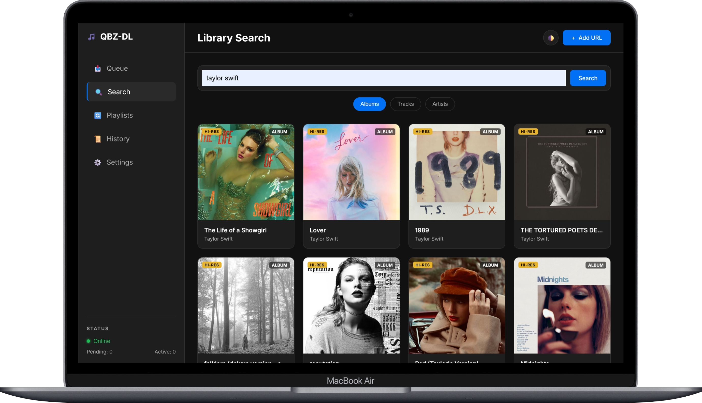

<div align="center">

# 🎵 QBZ-Downloader

### *The Ultimate Qobuz Music Downloader*

**Download Hi-Res FLAC Audio up to 24-bit/192kHz with Complete Metadata & Synchronized Lyrics**

[](https://github.com/ifauzeee/QBZ-Downloader/releases)
[](https://nodejs.org/)
[](LICENSE)
[](https://github.com/ifauzeee/QBZ-Downloader)
[](https://www.typescriptlang.org/)

<br/>

[📥 Installation](#-installation) •
[🚀 Quick Start](#-quick-start) •
[💻 Web Dashboard](#-web-dashboard) •
[🤖 Telegram Bot](#-telegram-bot) •
[📖 Documentation](#-configuration)

<br/>



</div>

---

## ✨ Highlights

### 🎧 Studio-Quality Audio
- **Hi-Res Max**: FLAC 24-bit/192kHz
- **Hi-Res**: FLAC 24-bit/96kHz  
- **CD Quality**: FLAC 16-bit/44.1kHz
- **Compressed**: MP3 320kbps

### 🎯 Smart Features
- **Auto-detect URLs** from clipboard
- **Batch download** albums & playlists
- **Skip already downloaded tracks**
- **Parallel downloads** (configurable)

### 📝 Complete Metadata
- Artist, Album, Track information
- High-resolution cover art
- **Synchronized lyrics** (LRC format)
- Genre, Label, Copyright, ISRC

### 🌐 Multiple Interfaces
- **CLI** - Command line interface
- **Web Dashboard** - Modern browser UI
- **Telegram Bot** - Remote downloads
- **TUI** - Rich terminal UI

---

## 📋 Table of Contents

- [✨ Highlights](#-highlights)
- [📥 Installation](#-installation)
- [🚀 Quick Start](#-quick-start)
- [💻 Web Dashboard](#-web-dashboard)
- [🤖 Telegram Bot](#-telegram-bot)
- [⚙️ Configuration](#️-configuration)
- [📖 CLI Reference](#-cli-reference)
- [🏗️ Architecture](#️-architecture)
- [❓ FAQ](#-faq)
- [🤝 Contributing](#-contributing)
- [📄 License](#-license)

---

## 📥 Installation

### Prerequisites

- **Node.js** 18.0.0 or higher
- **Qobuz** subscription (required for Hi-Res audio)
- **Git** (for cloning)

### Method 1: From Source (Recommended)

```bash
# Clone the repository
git clone https://github.com/ifauzeee/QBZ-Downloader.git
cd QBZ-Downloader

# Install dependencies
npm install

# Build the project
npm run build

# Link globally
npm link
```

After linking, the `qbz-dl` command will be available globally.

### Method 2: Docker

```bash
# Clone and run with Docker Compose
git clone https://github.com/ifauzeee/QBZ-Downloader.git
cd QBZ-Downloader

# Configure environment
cp .env.example .env
# Edit .env with your credentials

# Run
docker-compose up -d
```

### Method 3: NPM (Coming Soon)

```bash
npm install -g qbz-downloader
```

---

## 🚀 Quick Start

### First Run

Run the setup wizard to configure your credentials:

```bash
qbz-dl setup
```

The wizard will guide you through:
1. **Qobuz Credentials** - App ID, Secret, Token, User ID
2. **Telegram Bot** (Optional) - For remote downloads
3. **Dashboard** - Port and password settings

### Download Your First Album

```bash
# Copy a Qobuz URL, then run:
qbz-dl

# Or download directly:
qbz-dl download https://play.qobuz.com/album/your-album-id
```

### Interactive Menu

Simply run without arguments for the interactive menu:

```bash
qbz-dl
```

<div align="center">

</div>

---

## 💻 Web Dashboard

A modern, responsive web interface for managing downloads from any device.

```bash
qbz-dl dashboard
```

Then open **http://localhost:3000** in your browser.

### Dashboard Features

- **📥 Queue** - Real-time download progress with live updates
- **🔍 Search** - Browse & search the entire Qobuz library
- **📜 History** - View all downloaded tracks with re-download option
- **⚙️ Settings** - Configure all options from the browser

### Dashboard Security

- **Password Protection** - Secure with `DASHBOARD_PASSWORD`
- **Rate Limiting** - Prevents brute force attacks
- **Encrypted Storage** - Credentials encrypted with AES-256

---

## 🤖 Telegram Bot

Control your downloads from anywhere using your personal Telegram bot.

### Setup

1. Create a bot with [@BotFather](https://t.me/BotFather)
2. Get your Chat ID from [@userinfobot](https://t.me/userinfobot)
3. Add credentials during setup or in dashboard settings

### Start the Bot

```bash
qbz-dl bot
```

### Bot Commands

| Command | Description |
|---------|-------------|
| `/dl <url>` | Download from URL |
| `/search <query>` | Search and download |
| `/status` | View queue status |
| `/quality` | Change default quality |
| `/settings` | View current settings |
| `/help` | Show all commands |

### Example Usage

```
You: /dl https://play.qobuz.com/album/123456

Bot: 📥 Added to queue!
     Album: Random Access Memories
     Artist: Daft Punk
     Tracks: 13
     Quality: Hi-Res 24/96

Bot: ✅ Download complete!
     [📁 Open Files]
```

---

## ⚙️ Configuration

### Configuration Hierarchy

```
Priority 1: CLI flags (--quality 27)     ← Temporary override
Priority 2: SQLite database              ← Persistent settings
Priority 3: Environment variables        ← Fallback
Priority 4: Default values               ← Built-in defaults
```

### Environment Variables

Create a `.env` file or use the setup wizard:

```env
# Required
QOBUZ_APP_ID=your_app_id
QOBUZ_APP_SECRET=your_app_secret
QOBUZ_USER_AUTH_TOKEN=your_token
QOBUZ_USER_ID=your_user_id

# Optional - Telegram
TELEGRAM_BOT_TOKEN=your_bot_token
TELEGRAM_CHAT_ID=your_chat_id

# Optional - Dashboard
DASHBOARD_PORT=3000
DASHBOARD_PASSWORD=your_secure_password
```

### How to Get Qobuz Credentials

1. Login to [play.qobuz.com](https://play.qobuz.com) in your browser
2. Open **Developer Tools** (F12)
3. Go to **Network** tab
4. Filter by `api.json`
5. Look for request headers:
   - `x-app-id` → `QOBUZ_APP_ID`
   - `x-user-auth-token` → `QOBUZ_USER_AUTH_TOKEN`
6. App Secret can be extracted from the page source

### Settings Reference

<details>
<summary><b>📂 Downloads</b></summary>

| Setting | Default | Description |
|---------|---------|-------------|
| `downloads.path` | `./downloads` | Output directory |
| `downloads.concurrent` | `4` | Max parallel downloads |
| `downloads.retryAttempts` | `3` | Retry failed downloads |
| `downloads.retryDelay` | `1000` | Delay between retries (ms) |
| `downloads.folderTemplate` | `{artist}/{album}` | Folder naming pattern |
| `downloads.fileTemplate` | `{track_number}. {title}` | File naming pattern |
| `downloads.proxy` | `""` | HTTP proxy URL |

</details>

<details>
<summary><b>🎵 Quality</b></summary>

| Quality ID | Format | Description |
|------------|--------|-------------|
| `27` | FLAC 24/192 | Hi-Res Max (Best) |
| `7` | FLAC 24/96 | Hi-Res |
| `6` | FLAC 16/44.1 | CD Quality |
| `5` | MP3 320kbps | Compressed |

</details>

<details>
<summary><b>📝 Metadata</b></summary>

| Setting | Default | Description |
|---------|---------|-------------|
| `embedLyrics` | `true` | Embed lyrics in file |
| `embedCover` | `true` | Embed cover art in file |
| `metadata.saveCoverFile` | `false` | Save cover.jpg separately |
| `metadata.saveLrcFile` | `false` | Save .lrc file separately |
| `metadata.coverSize` | `max` | Cover art size |
| `metadata.lyricsType` | `both` | `synced`, `plain`, or `both` |

</details>

<details>
<summary><b>📲 Telegram</b></summary>

| Setting | Default | Description |
|---------|---------|-------------|
| `telegram.uploadFiles` | `true` | Upload files to Telegram |
| `telegram.autoDelete` | `true` | Delete local file after upload |
| `telegram.allowedUsers` | `""` | Comma-separated user IDs |

</details>

---

## 📖 CLI Reference

### Commands

```bash
qbz-dl [command] [options]
```

| Command | Alias | Description |
|---------|-------|-------------|
| `download <url>` | `dl` | Download from URL |
| `search <query>` | `s` | Search and download |
| `info <url>` | - | Show metadata info |
| `lyrics <url>` | - | Fetch and display lyrics |
| `account` | - | Show account info |
| `quality` | `q` | Display quality options |
| `dashboard` | `web` | Launch web dashboard |
| `bot` | - | Start Telegram bot |
| `setup` | - | Run setup wizard |
| `help` | `h` | Show detailed help |
| `examples` | - | Show usage examples |

### Download Options

```bash
qbz-dl download <url> [options]

Options:
  -q, --quality <id>    Audio quality (5, 6, 7, or 27)
  -o, --output <path>   Custom output directory
  --no-lyrics           Skip lyrics embedding
  --no-cover            Skip cover art embedding
  -s, --skip-existing   Skip already downloaded tracks
  -i, --interactive     Force interactive mode
```

### Usage Examples

```bash
# Download album with max quality
qbz-dl download https://play.qobuz.com/album/abc123 -q 27

# Download with custom output
qbz-dl download <url> -o "D:/Music/HiRes"

# Search and download interactively
qbz-dl search "Bohemian Rhapsody"

# Download without lyrics
qbz-dl download <url> --no-lyrics

# Skip existing files (faster re-downloads)
qbz-dl download <url> -s

# Show album info without downloading
qbz-dl info https://play.qobuz.com/album/abc123
```

---

## 🏗️ Architecture

### Project Structure

```
qobuz-dl-cli/
├── src/
│   ├── api/                  # Qobuz API client
│   │   ├── qobuz.ts         # Main API wrapper
│   │   └── lyrics.ts        # LRCLib lyrics provider
│   │
│   ├── commands/            # CLI commands
│   │   ├── download.tsx     # Download command with TUI
│   │   ├── search.ts        # Search command
│   │   ├── setup.ts         # Setup wizard
│   │   ├── help.ts          # Help & examples
│   │   └── ...
│   │
│   ├── services/            # Core business logic
│   │   ├── download.ts      # Download engine
│   │   ├── metadata.ts      # Metadata embedding
│   │   ├── settings.ts      # Settings management
│   │   ├── database.ts      # SQLite storage
│   │   ├── history.ts       # Download history
│   │   ├── dashboard/       # Web dashboard
│   │   │   ├── index.ts     # Express server
│   │   │   ├── routes.ts    # API endpoints
│   │   │   └── public/      # Frontend assets
│   │   ├── telegram/        # Telegram bot
│   │   │   ├── index.ts     # Bot setup
│   │   │   ├── handlers/    # Command handlers
│   │   │   ├── queue.ts     # Download queue
│   │   │   └── security/    # Rate limiting, validation
│   │   └── scheduler/       # Background tasks
│   │
│   ├── utils/               # Utility functions
│   │   ├── encryption.ts    # AES-256 encryption
│   │   ├── network.ts       # HTTP client
│   │   ├── errors.ts        # Error handling
│   │   ├── friendly-errors.ts # User-friendly messages
│   │   └── ...
│   │
│   ├── ui/                  # Terminal UI components
│   │   ├── TrackSelector.js # Track selection UI
│   │   └── DownloadManagerUI.js
│   │
│   ├── types/               # TypeScript interfaces
│   ├── config.ts            # Configuration loader
│   ├── constants.ts         # App constants
│   └── index.ts             # Entry point
│
├── data/                    # Runtime data (gitignored)
│   ├── qbz.db              # SQLite database
│   └── .secret.key         # Encryption key
│
├── downloads/               # Downloaded files (gitignored)
├── dist/                    # Compiled JavaScript
├── .env.example             # Environment template
├── package.json
├── tsconfig.json
└── README.md
```

### Technology Stack

| Layer | Technology |
|-------|------------|
| **Runtime** | Node.js 18+ |
| **Language** | TypeScript 5.7 |
| **CLI Framework** | Commander.js |
| **Terminal UI** | Ink (React for CLI), Inquirer |
| **Web Server** | Express 5 |
| **Real-time** | Socket.IO |
| **Database** | SQLite (node:sqlite) |
| **Telegram** | Telegraf |
| **HTTP Client** | Axios |
| **Audio Metadata** | node-id3, flac-metadata |
| **Testing** | Vitest |
| **Linting** | ESLint + Prettier |

### Data Flow

```
┌─────────────┐     ┌─────────────┐     ┌─────────────┐
│    CLI      │     │  Dashboard  │     │  Telegram   │
│   Command   │     │   (Web UI)  │     │    Bot      │
└──────┬──────┘     └──────┬──────┘     └──────┬──────┘
       │                   │                   │
       └───────────────────┼───────────────────┘
                           │
                           ▼
              ┌────────────────────────┐
              │    Download Queue      │
              │    (Event Emitter)     │
              └───────────┬────────────┘
                          │
                          ▼
              ┌────────────────────────┐
              │   Download Service     │
              │   • Fetch from Qobuz   │
              │   • Get Lyrics         │
              │   • Embed Metadata     │
              └───────────┬────────────┘
                          │
           ┌──────────────┼──────────────┐
           ▼              ▼              ▼
     ┌──────────┐   ┌──────────┐   ┌──────────┐
     │  Qobuz   │   │  LRCLib  │   │  SQLite  │
     │   API    │   │  (Lyrics)│   │ Database │
     └──────────┘   └──────────┘   └──────────┘
```

---

## 🔒 Security

### Credential Protection

- **AES-256-CBC Encryption** - All sensitive data encrypted at rest
- **Unique Encryption Key** - Auto-generated per installation
- **Masked API Responses** - Credentials shown as `••••••••xxxx`
- **Password-Protected Dashboard** - Optional authentication
- **Rate Limiting** - API abuse prevention

### What's Stored Securely

| Data | Storage | Encryption |
|------|---------|------------|
| Qobuz credentials | SQLite | ✅ AES-256 |
| Telegram token | SQLite | ✅ AES-256 |
| Download history | SQLite | ❌ Not sensitive |
| Settings | SQLite | ❌ Not sensitive |

---

## ❓ FAQ

<details>
<summary><b>How do I get my Qobuz credentials?</b></summary>

1. Go to [play.qobuz.com](https://play.qobuz.com)
2. Login to your account
3. Open Developer Tools (F12)
4. Go to Network tab, filter `api.json`
5. Look for `x-app-id` and `x-user-auth-token` in headers

For detailed instructions with screenshots, see our [Wiki](https://github.com/ifauzeee/QBZ-Downloader/wiki/Getting-Credentials).

</details>

<details>
<summary><b>Why am I getting 401/403 errors?</b></summary>

- **401 Unauthorized**: Your token has expired. Run `qbz-dl setup` again.
- **403 Forbidden**: The content requires a higher subscription tier (e.g., Hi-Res needs Studio/Premier).

</details>

<details>
<summary><b>Can I download in Hi-Res without a premium subscription?</b></summary>

No. Hi-Res audio (24-bit) requires a Qobuz Studio or Studio Premier subscription. CD quality (16-bit) requires at least a Qobuz Studio subscription.

</details>

<details>
<summary><b>How do I change the download folder?</b></summary>

Three ways:
1. **CLI**: `qbz-dl download <url> -o /your/path`
2. **Dashboard**: Settings → Download Path
3. **Settings**: Modify `downloads.path` in database

</details>

<details>
<summary><b>Is this legal?</b></summary>

This tool is for personal use only. You must have a valid Qobuz subscription and only download content you have the right to access. The developers are not responsible for misuse.

</details>

<details>
<summary><b>How do I update to a new version?</b></summary>

```bash
cd QBZ-Downloader
git pull
npm install
npm run build
npm link
```

</details>

---

## 🤝 Contributing

Contributions are welcome! Here's how you can help:

### Development Setup

```bash
# Clone and install
git clone https://github.com/ifauzeee/QBZ-Downloader.git
cd QBZ-Downloader
npm install

# Start development mode
npm run dev

# Run tests
npm run test

# Lint code
npm run lint
npm run lint:fix
```

### Contribution Guidelines

1. **Fork** the repository
2. Create a **feature branch** (`git checkout -b feature/amazing-feature`)
3. **Commit** your changes (`git commit -m 'Add amazing feature'`)
4. **Push** to the branch (`git push origin feature/amazing-feature`)
5. Open a **Pull Request**

### Code Style

- Use **TypeScript** strict mode
- Follow **ESLint** + **Prettier** configurations
- Write **tests** for new features
- Update **documentation** as needed

---

## 📄 License

This project is licensed under the **MIT License** - see the [LICENSE](LICENSE) file for details.

```
MIT License

Copyright (c) 2024-2026 ifauzeee

Permission is hereby granted, free of charge, to any person obtaining a copy
of this software and associated documentation files (the "Software"), to deal
in the Software without restriction, including without limitation the rights
to use, copy, modify, merge, publish, distribute, sublicense, and/or sell
copies of the Software...
```

---

## 🙏 Acknowledgments

- [Qobuz](https://www.qobuz.com/) - For amazing Hi-Res audio
- [LRCLib](https://lrclib.net/) - For synchronized lyrics
- [Telegraf](https://telegraf.js.org/) - Telegram bot framework
- [Ink](https://github.com/vadimdemedes/ink) - React for CLI

---

<div align="center">

### ⭐ Star this repo if you find it useful!

**Made with ❤️ by [ifauzeee](https://github.com/ifauzeee)**