<div align="center">

# 🎵 QBZ-Downloader

### *The Ultimate High-Resolution Audio Downloader & Library Management Platform*

[](https://github.com/ifauzeee/QBZ-Downloader/releases)
[](https://react.dev/)
[](https://vitejs.dev/)
[](https://www.typescriptlang.org/)
[](https://nodejs.org/)
[](https://www.docker.com/)
[](LICENSE)

<br/>

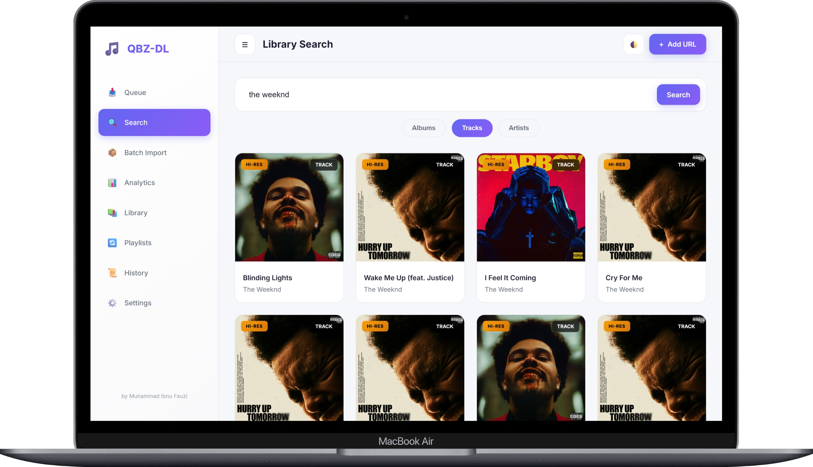

<br/>

**Unlock the full potential of your music library.**

A comprehensive, enterprise-grade music downloading and library management platform that delivers studio-quality FLAC audio up to **24-bit/192kHz** with complete metadata tagging, synchronized lyrics embedding & editing, intelligent queue management, advanced analytics, and a beautiful real-time web dashboard.

[✨ Features](#-key-features-at-a-glance) •
[📥 Installation](#-installation) •
[⚙️ Configuration](#️-configuration) •
[🚀 Usage](#-usage-guide) •
[📚 API Docs](#-api-documentation) •
[🏗️ Architecture](#️-system-architecture)

</div>

---

## ✨ Key Features at a Glance

Everything you need to build the perfect local music library.

| Feature | Description |
| :--- | :--- |
| **🎵 Studio Quality** | Download music in **Hi-Res FLAC (up to 24-bit/192kHz)**. Identical to the source file, with no quality loss or conversion. |
| **🖥️ Modern UI** | Built with **React & Vite**. Features a beautiful interface with **Light/Dark Mode**, real-time updates, and smooth animations. |
| **🎤 Smooth Lyrics** | Enjoy **60fps synchronized lyrics** with a jitter-free scrolling experience. Includes a built-in **Lyrics Editor**. |
| **🎼 Audio Visualizer** | Real-time audio visualization built directly into the player for an immersive listening experience. |
| **🏷️ Smart Tags** | Files are automatically tagged with **Cover Art, Lyrics, Artist, Album, Year, and Genre**. |
| **📦 Batch Download** | Download **Full Albums**, **Artist Discographies**, or **Playlists** with just one click. |
| **📚 Library Manager** | Scans your downloaded files to **detect duplicates**, find missing metadata, and suggest tracks that can be upgraded. |
| **📊 Analytics** | View visual charts of your collection: total downloads, quality distribution, top artists, and storage usage. |
| **🐳 Docker Ready** | Easy to install and run anywhere using Docker. Keeps your system clean and secure. |
| **🌍 Multi-Language** | Fully translated into **7 languages** (English, Indonesian, Spanish, French, German, Japanese, Chinese). |

---

## 📋 Table of Contents

1. [Overview](#-overview)
2. [📸 Interface Showcases](#-interface-showcases)
3. [Why QBZ-Downloader?](#-why-qbz-downloader)
4. [Comprehensive Feature Overview](#-comprehensive-feature-overview)
5. [Installation](#-installation)
6. [Configuration](#️-configuration)
7. [Usage Guide](#-usage-guide)
8. [System Architecture](#️-system-architecture)
9. [Technology Stack](#-technology-stack)
10. [Troubleshooting](#-troubleshooting)

---

## 📸 Interface Showcases

Take a tour through the beautiful and functional interface of QBZ-Downloader.

### 🔍 Multi-Dimensional Search
Quickly find your music using our optimized search engine that categorizes results for maximum efficiency.

| Search Tracks | Search Albums | Search Artists |
| :---: | :---: | :---: |
| 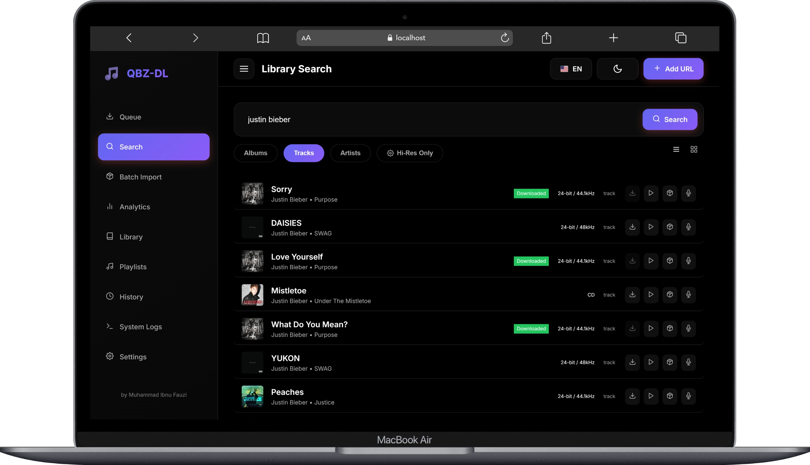 | 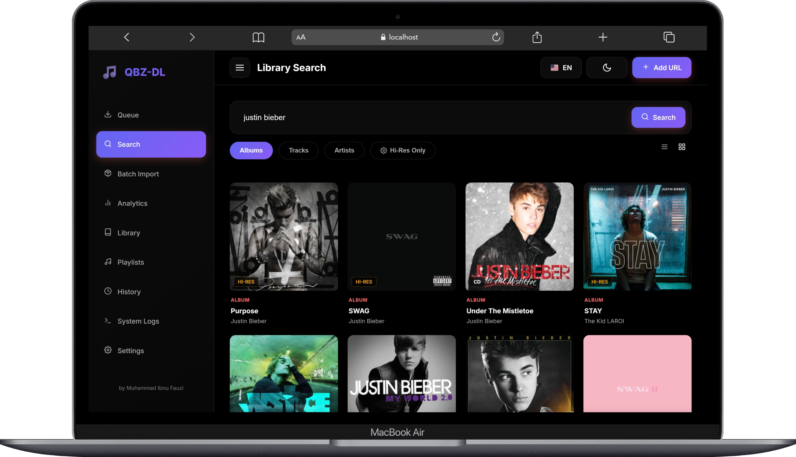 | 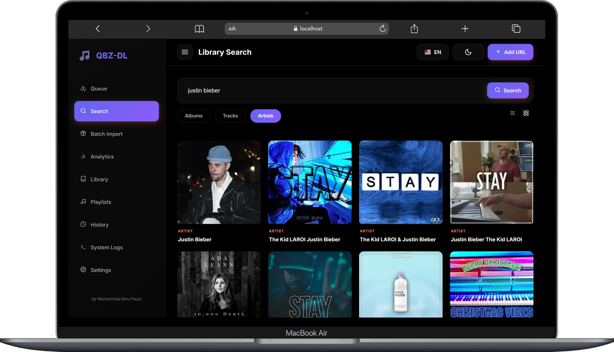 |
| Find individual tracks | Discover full discographies | Explore artist profiles |

### 👤 Artist & Album Exploration
Dive deep into artist metadata and explore every track in crystal-clear quality.

| Artist Detail | Artist Albums | Artist Tracks | Album Tracks |
| :---: | :---: | :---: | :---: |
| 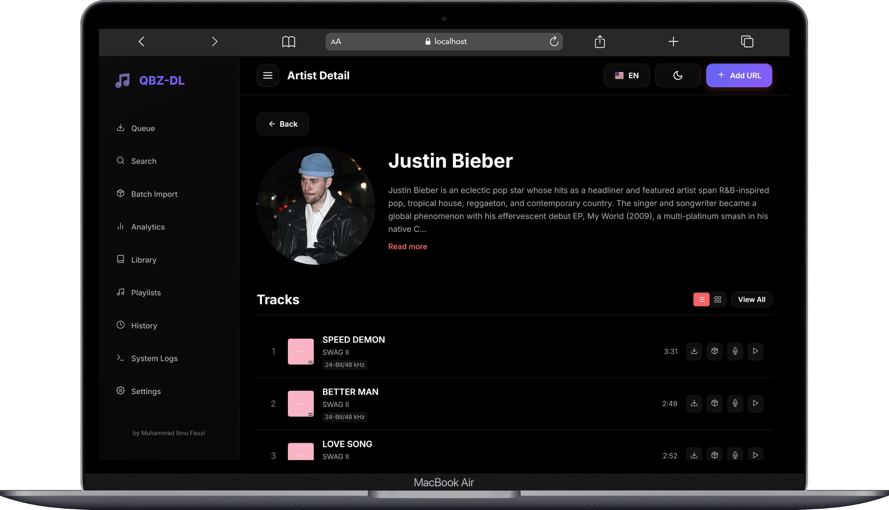 |  | 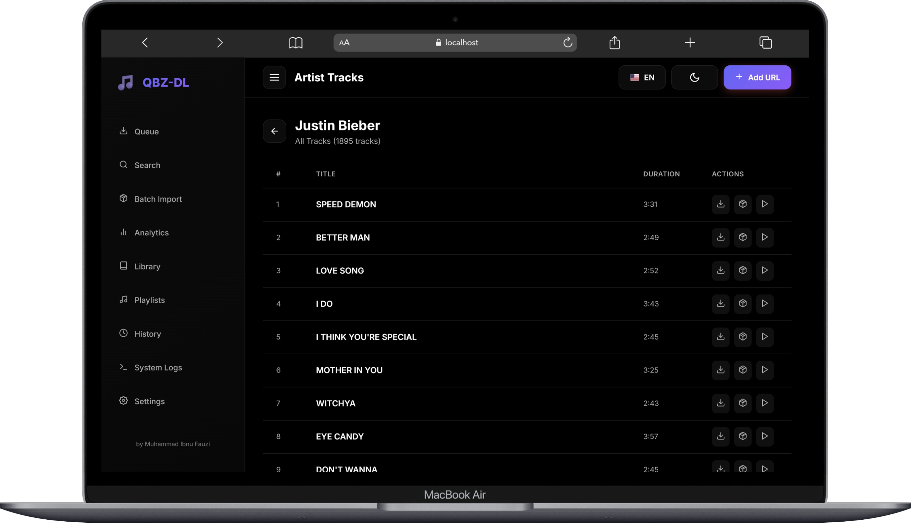 | 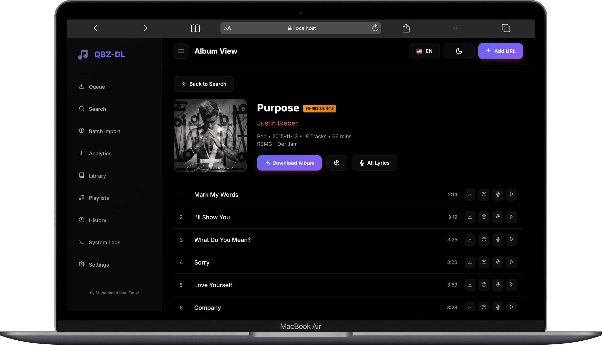 |
| Biography & Top Tracks | Browse all releases | Explore all artist tracks | Full tracklist metadata |

### 🎵 Immersive Playback & Playlists
Enjoy your library with a premium player experience.

| Synchronized Lyrics | Playlist Management |
| :---: | :---: |
| 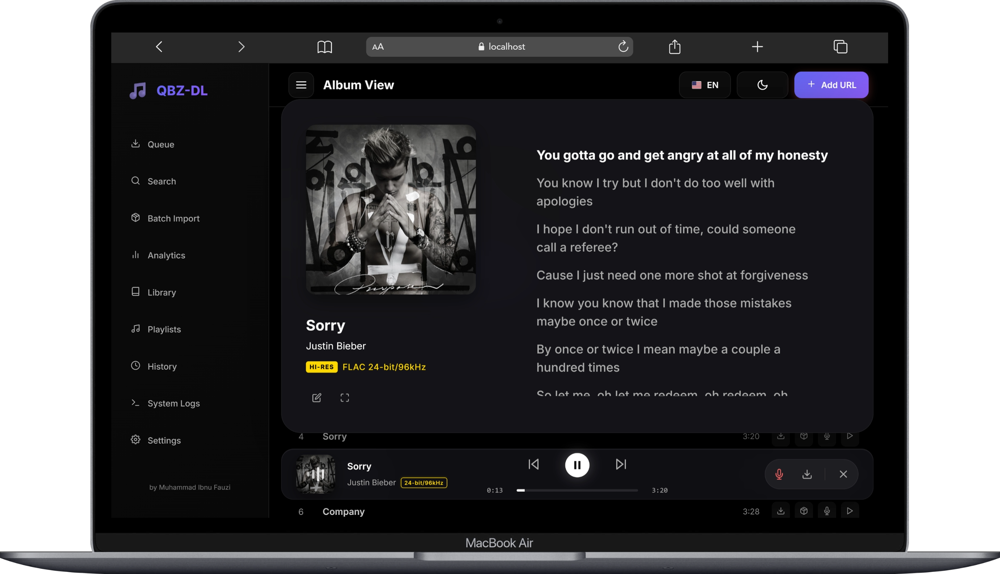 | 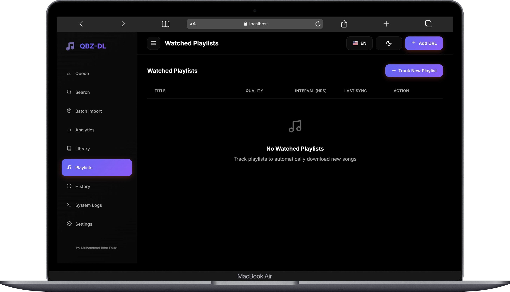 |
| 60fps smooth scrolling LRC lyrics | Organize your favorite collections |

### 📥 Advanced Download Engine
Manage your downloads with precision using our powerful queue and history tracking.

| Download Queue | History Tracking | Batch Import |
| :---: | :---: | :---: |
|  | 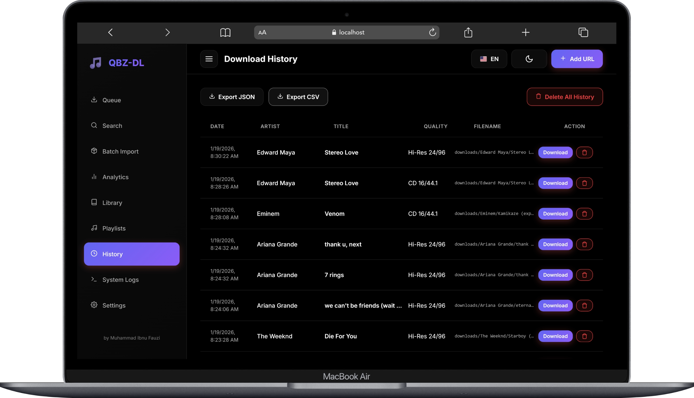 | 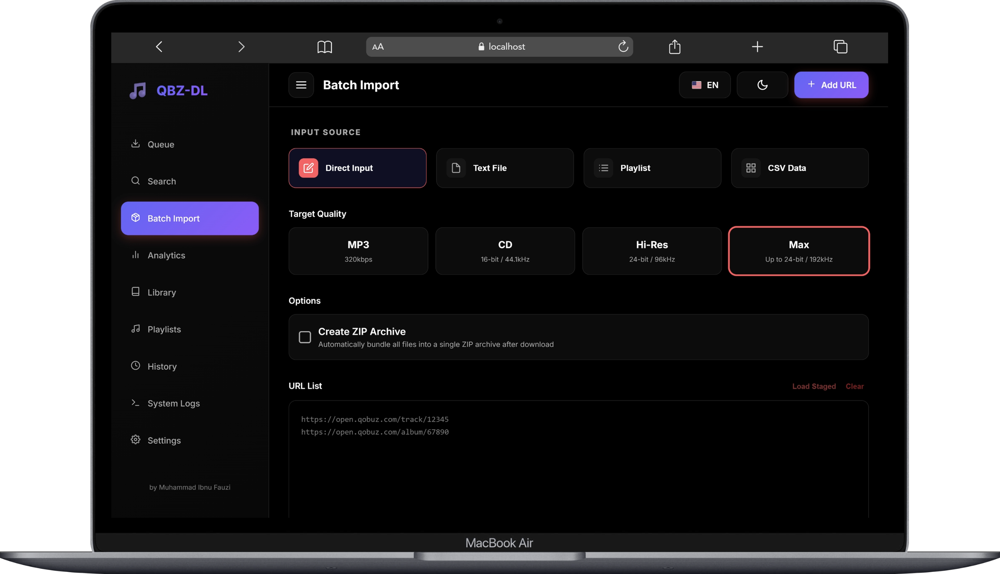 |
| Active progress with speed monitors | Keep track of your collection | Import thousands of links at once |

### 📚 Intelligent Library Management
Keep your local library perfect with automated scanning and optimization tools.

| Metadata Audit | Hi-Res Upgrade | Duplicate Finder |
| :---: | :---: | :---: |
| 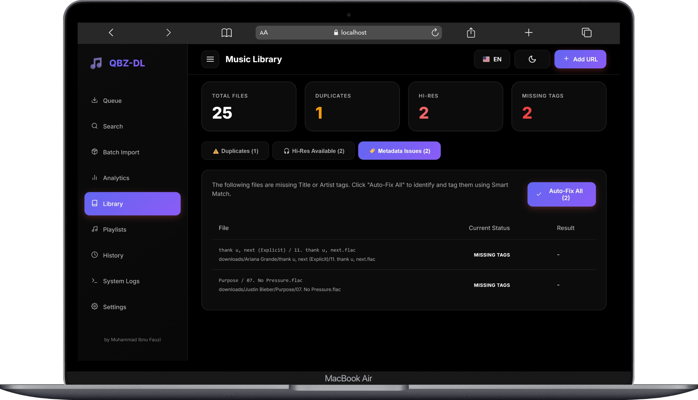 | 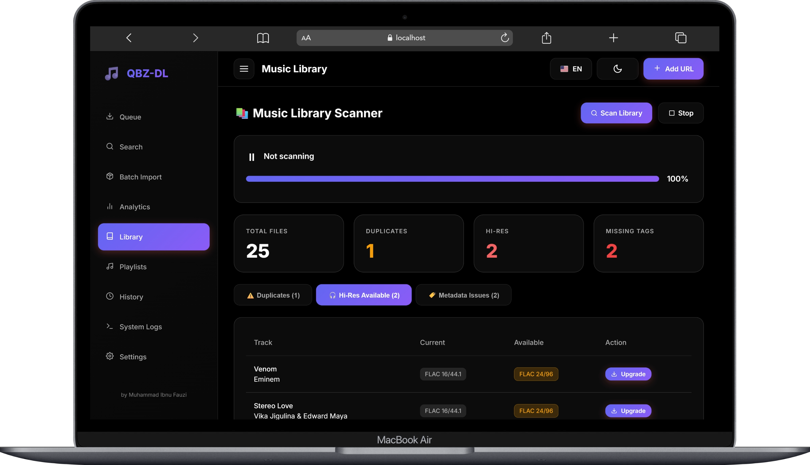 | 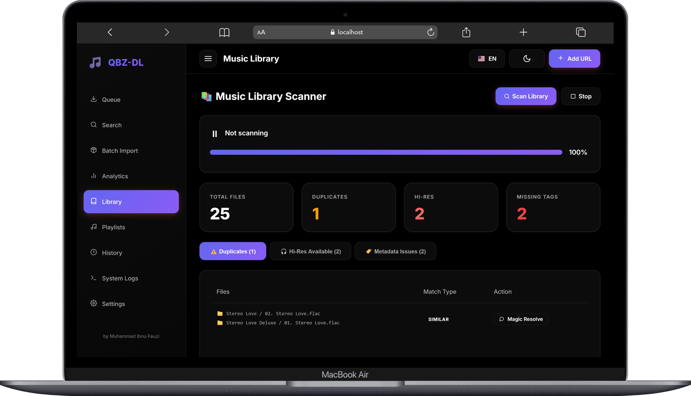 |
| Fix missing tags & artwork | Identify tracks to upgrade | Save space by removing clones |

### 📊 Analytics & Control
Monitor your system and visualize your collection's growth.

| Collection Analytics | System Settings | Background Logs |
| :---: | :---: | :---: |
| 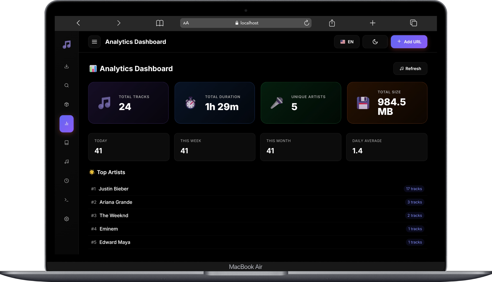 | 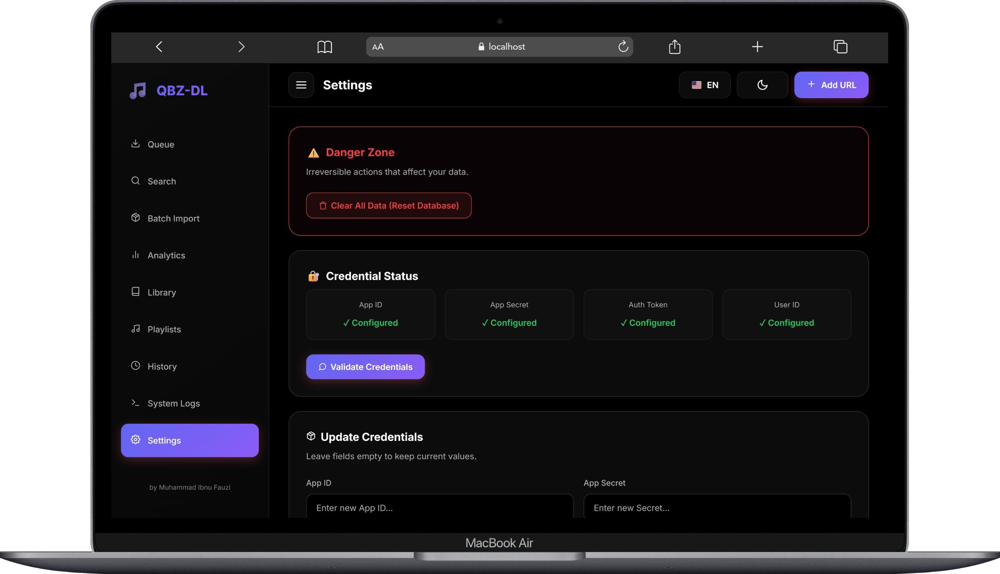 | 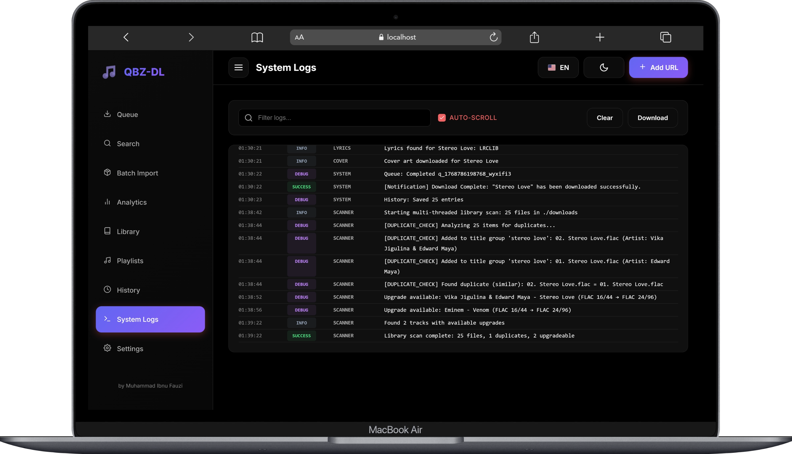 |
| Visual data on your library | Fine-tune your experience | Monitor engine activity |

---

## 🌟 Overview

**QBZ-Downloader** is more than just a downloader script — it is a complete music management system. Built with a robust **Node.js** backend and a high-performance **React** frontend, it ensures a seamless experience for audiophiles and archivists.

### Development Philosophy

```
🎯 Bit-Perfect Audio  →  No transcoding, original quality preserved
🎨 UX First           →  React-based UI with 60fps animations & Light Mode support
📊 Data-Driven        →  SQLite database for tracking & analytics
⚡ Real-Time          →  WebSocket for instant progress updates
🔒 Secure by Design   →  Input validation, XSS protection, rate limiting
```

---

## 💡 Why QBZ-Downloader?

| Feature | QBZ-Downloader | Other Scripts |
|-------|:--------------:|:-----------:|
| **Tech Stack** | React + Vite + Node.js | Basic HTML/JS |
| **Visual Experience** | ✅ Light/Dark Mode + Visualizer | ❌ Dark only |
| **Lyrics Experience** | ✅ Smooth 60fps Sync | ⚠️ Static/Basic |
| **Hi-Res Audio (192kHz)** | ✅ | ⚠️ Limited |
| **Database Tracking** | ✅ SQLite | ❌ |
| **Duplicate Detection** | ✅ Intelligent | ❌ |
| **Library Scanner** | ✅ Deep scan + upgrade detection | ❌ |
| **Docker Support** | ✅ Multi-stage build | ⚠️ Basic |

---

## ✨ Comprehensive Feature Overview

### 🎧 Audiophile-Grade Audio Engine

- **Bit-Perfect Download**: Audio is downloaded exactly as streamed without transcoding.
- **Smart Quality Fallback**: Automatically tries lower quality if preference is unavailable (192k → 96k → 44.1k).
- **Stream Preview**: Listen to track previews directly on the dashboard.

### 📝 Metadata & Lyrics

- **Full Tagging**: Title, Artist, Album, Year, Genre, Composers, Producers, ISRC, UPC, etc.
- **High-Res Artwork**: Embeds up to 3000x3000px cover art.
- **Lyrics System**:
    - **Providers**: LRCLIB (Primary), Genius (Fallback).
    - **Formats**: Synced (LRC), Plain Text, Embedded.
    - **Editor**: Fix timing or text directly in the app.

---

## 📥 Installation

### Option A: 🐳 Docker (Recommended)

Docker provides a consistent and easy-to-maintain environment.

```bash
# 1. Clone repository
git clone https://github.com/ifauzeee/QBZ-Downloader.git
cd QBZ-Downloader

# 2. Setup environment file
cp .env.example .env
# Edit .env with your Qobuz credentials

# 3. Build and run
docker-compose up -d

# 4. Access Dashboard
# Open http://localhost:3000 in your browser
```

### Option B: 🛠️ Manual Setup

```bash
# 1. Clone repository
git clone https://github.com/ifauzeee/QBZ-Downloader.git
cd QBZ-Downloader

# 2. Install dependencies
npm install

# 3. Build dependencies (Backend & Frontend)
npm run build:full

# 4. Setup environment
cp .env.example .env
# Edit .env with your credentials

# 5. Start Application
npm start
```

---

## ⚙️ Configuration

Create a `.env` file in the root directory.

### 🔑 Authentication (Required)

```env
# App credentials (get these from browser dev tools on play.qobuz.com)
QOBUZ_APP_ID=your_app_id
QOBUZ_APP_SECRET=your_app_secret

# User credentials
QOBUZ_USER_AUTH_TOKEN=your_user_token
QOBUZ_USER_ID=your_user_id
```

### 📁 File Management

```env
# Download path
DOWNLOADS_PATH=./downloads

# Folder structure template
FOLDER_TEMPLATE={albumArtist}/{album}

# File name template
FILE_TEMPLATE={track_number}. {title}
```

---

## 🏗️ System Architecture

### High-Level Architecture

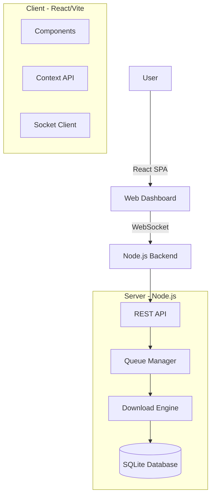

### Directory Structure

```
qbz-downloader/
├── 📁 client/                  # Frontend (React + Vite)
│   ├── 📁 src/
│   │   ├── 📁 components/     # UI Components
│   │   ├── 📁 contexts/       # Global State
│   │   └── 📁 utils/          # Frontend Utilities
│   └── vite.config.ts
│
├── 📁 src/                     # Backend (Node.js)
│   ├── 📁 api/                # Qobuz & Lyrics APIs
│   ├── 📁 services/           # Core Logic (Download, Queue, DB)
│   └── index.ts               # Entry Point
│
├── 📁 data/                    # Database & History
├── 📁 downloads/               # Downloaded Files
└── 📄 docker-compose.yml
```

---

## 🛠️ Technology Stack

### Frontend (New!)
| Technology | Purpose |
|------------|---------|
| **React 18** | UI Library |
| **Vite** | Next Generation Frontend Tooling |
| **TypeScript** | Type Safety |
| **CSS Variables** | Dynamic Theming (Light/Dark) |

### Backend
| Technology | Purpose |
|------------|---------|
| **Node.js** | Runtime Environment |
| **Express.js** | Web Framework |
| **Socket.IO** | Real-time Communication |
| **Better-SQLite3** | High-performance Database |

---

## 🤝 Contributing

We strictly welcome contributions!

1. **Fork** the repository
2. **Clone** your fork
3. **Create a branch**: `git checkout -b feature/amazing-feature`
4. **Commit changes**: `git commit -m "feat: add amazing feature"`
5. **Push** to branch: `git push origin feature/amazing-feature`
6. **Open a Pull Request**

---

<div align="center">

**Made with ❤️ by [Muhammad Ibnu Fauzi (ifauzeee)](https://github.com/ifauzeee)**

*Premium High-Resolution Audio Downloader & Library Manager*

[](https://github.com/ifauzeee)

</div>
