<div align="center">

# 🎵 QBZ-Downloader
### *The Ultimate High-Resolution Audio Downloader & Library Manager*

[](https://github.com/ifauzeee/QBZ-Downloader/releases)
[](https://react.dev/)
[](https://www.typescriptlang.org/)
[](https://nodejs.org/)
[](LICENSE)

<br/>

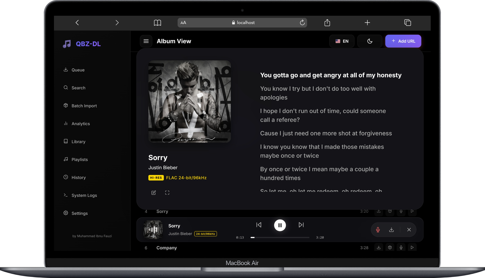

<br/>

**Unlock the full potential of your music library.**

A comprehensive desktop-first music downloading and library management application for Windows. Experience studio-quality audio up to **24-bit/192kHz** with complete metadata, synchronized lyrics, intelligent queue management, and a polished EXE workflow.

[✨ Features](#-key-features) •
[📥 Installation](#-installation) •
[⚙️ Configuration](#-configuration) •
[🖥️ Desktop Mode](#desktop-exe-windows) •
[📸 Screenshots](#-interface-showcase)

</div>

<br/>

> [!IMPORTANT]
> **🚀 v5.1.3 Release is here!**
> This update introduces **Pure AMOLED Black**, **Persistent Auth Fixes**, and **Improved Data Reliability**. Check the [Changelog](CHANGELOG.md) for full details.

---

## ✨ Key Features

Everything you need to build the perfect local music library.

| Feature | Description |
| :--- | :--- |
| **🎵 Studio Quality** | Download in **Hi-Res FLAC (up to 24-bit/192kHz)**. Bit-perfect replicas of the source. |
| **🖥️ Modern Desktop UI** | Beautiful **React & Vite** interface with **Light/Dark Mode**, real-time updates, and smooth animations. |
| **🎤 Live Lyrics** | Experience synchronized lyrics with **60fps smooth scrolling**. Includes a built-in **Lyrics Editor**. |
| **🏷️ Smart Tagging** | Automatic tagging with **High-Res Cover Art**, Artist, Album, Year, Genre, ISRC, and more. |
| **📦 Batch Power** | Download **Full Albums**, **Artist Discographies**, or **Playlists** with a single click. |
| **📚 Library Manager** | Scans your library to **detect duplicates**, identify missing metadata, and suggest upgrades. |
| **🎼 Visualizer** | Built-in real-time audio visualization for an immersive listening experience. |
| **📊 Analytics** | Visualize your collection with charts: quality distribution, top artists, and storage mastery. |
| **🔄 Resumable** | **New!** Support for HTTP Range to resume interrupted downloads seamlessly. |
| **🔌 Bandwidth Ctrl** | **New!** Limit download speed to save bandwidth for other activities. |
| **🔐 Encrypted Auth** | Sensitive Qobuz credentials are now encrypted in the local database. |
| **🌍 Spotify Migration** | Import your playlists from Spotify directly into Qobuz for high-res downloading. |
| **🔍 Quality Scan** | **New!** Automated spectral analysis to detect upsampled/fake lossless files. |
| **📡 Media Sync** | **New!** Auto-notify **Plex** or **Jellyfin** to rescan library after download. |
| **📤 Auto Export** | **New!** Automatically convert FLAC to **MP3/AAC/Opus** for mobile devices. |
| **👀 Playlist Watcher**| **New!** Automatically monitor and sync new tracks from your favorite playlists. |
| **🧩 Desktop Runtime** | Optimized for Windows EXE delivery with local-first configuration and storage. |

---

## 📸 Interface Showcase

Explore the beautiful, functional interface of QBZ-Downloader.

### 🔍 Discovery & Search
Quickly find your music with our optimized search engine.
<div align="center">
  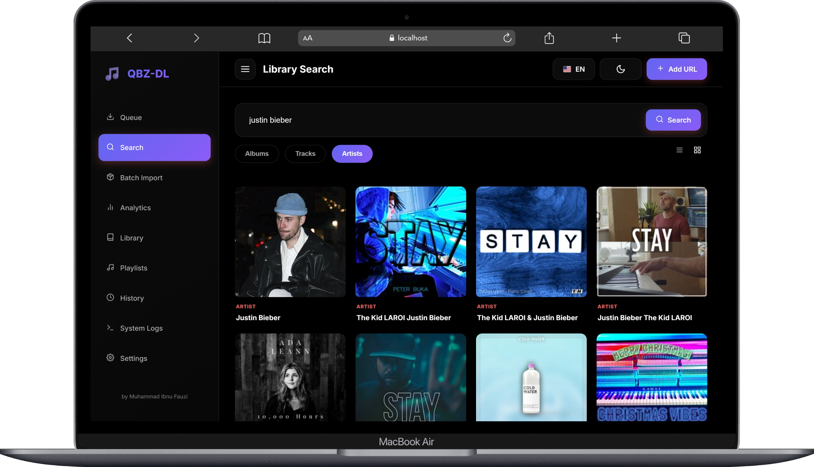
  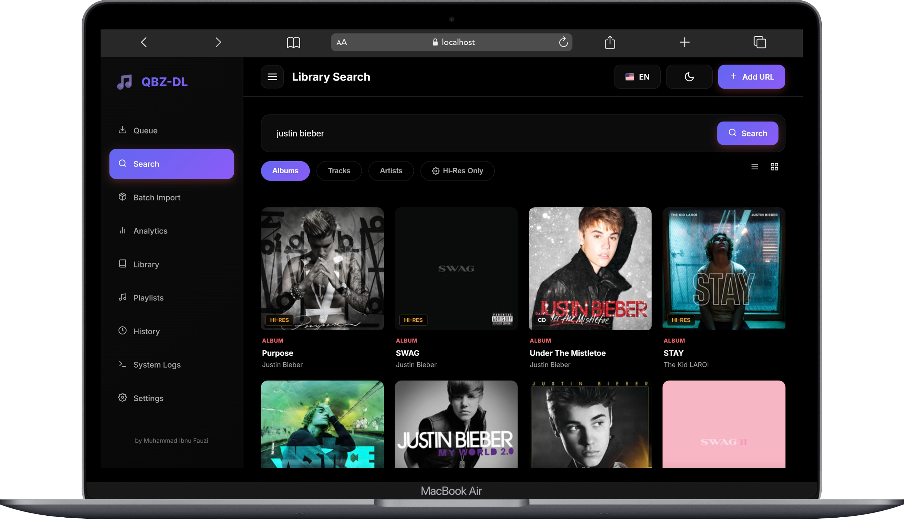
  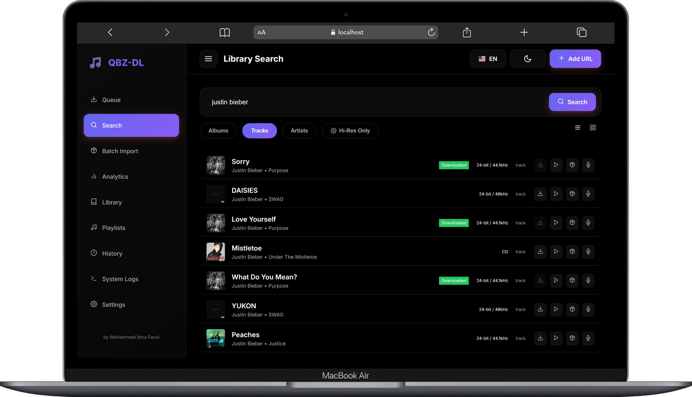
</div>

### 👤 Deep Metadata Exploration
Dive into detailed artist biographies and album credits.
<div align="center">
  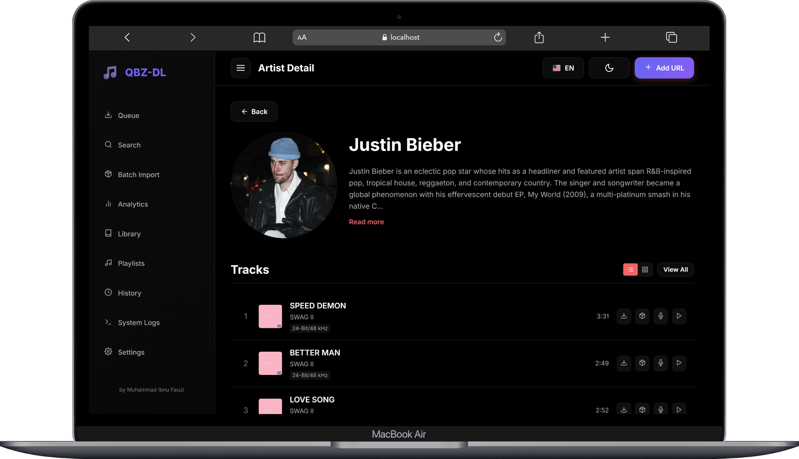
  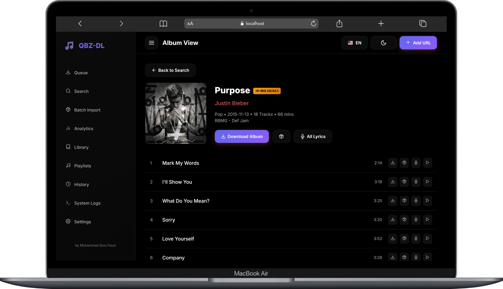
</div>

### 📥 Download Management
Track your downloads with precision and history.
<div align="center">
  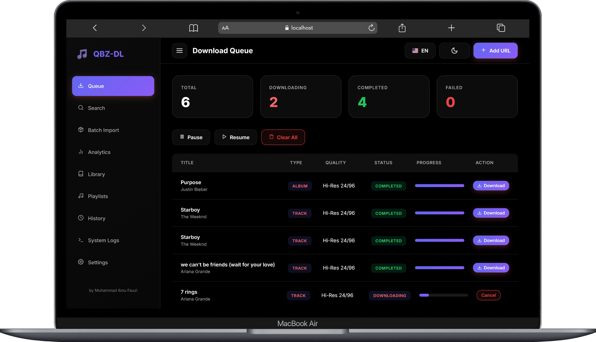
  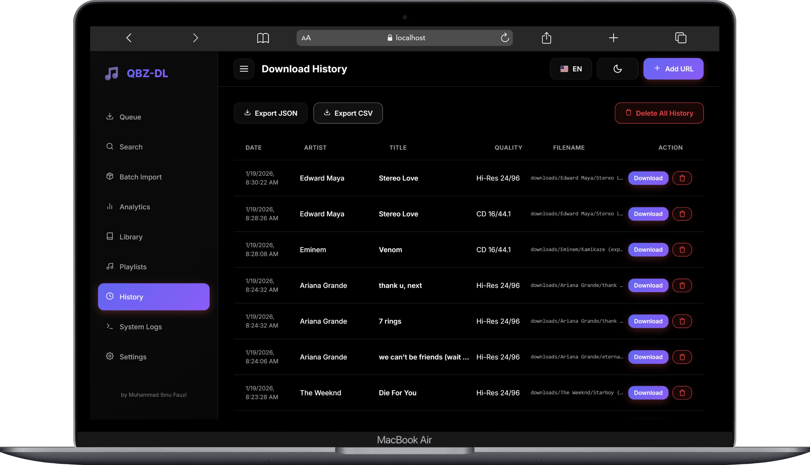
</div>

### 📚 Library Tools
Keep your collection pristine.
<div align="center">
  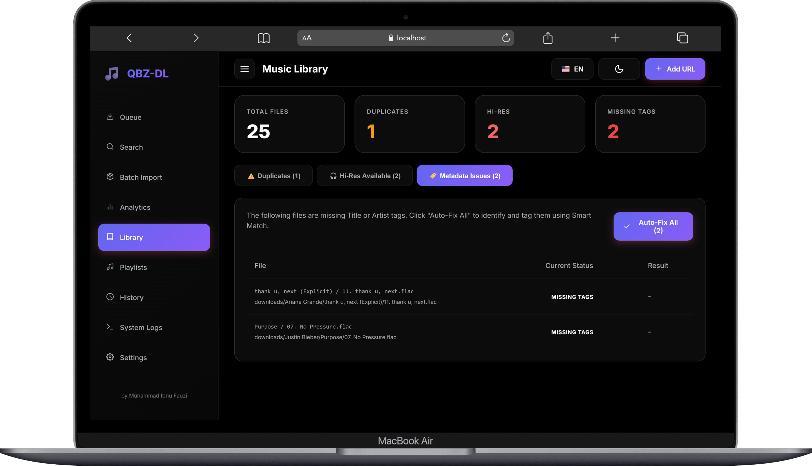
  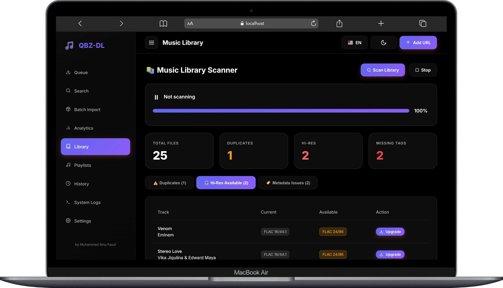
  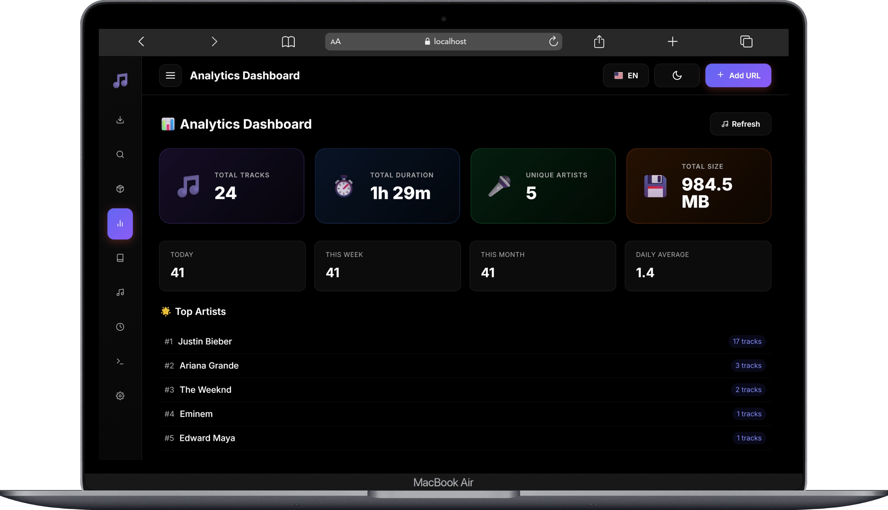
</div>

<div align="center">
  <br/>
  <a href="https://ifauzeee.vercel.app/projects/qbz-downloader/preview">
    
  </a>
</div>

---

## 📥 Installation

### Desktop EXE (Windows)
QBZ-Downloader is built as a native Windows application. Install the ready-to-use EXE directly from GitHub Releases:

1. Download the latest `.exe` from [Releases](https://github.com/ifauzeee/QBZ-Downloader/releases).
2. Run the installer or the portable version.
3. Complete the onboarding process and enter your Qobuz credentials in Settings.

### Development Build
If you wish to build the EXE from source:

```bash
# 1. Install dependencies
npm install

# 2. Build both client and server
npm run build:full

# 3. Create installer
npm run desktop:dist
```

Output paths:
- Installer: `release/QBZ-Downloader-Setup-<version>.exe`
- Portable: `release/QBZ-Downloader-Portable-<version>.exe`

---

## ⚙️ Configuration

All settings are managed directly within the app's **Settings UI** and stored in a local SQLite database.

### 🔑 Authentication
Configure these in the app:
- `QOBUZ_APP_ID`
- `QOBUZ_APP_SECRET`
- `QOBUZ_USER_AUTH_TOKEN`
- `QOBUZ_USER_ID`

Notes:
- No `.env` file or manual configuration is required.
- App data is stored in `%APPDATA%/QBZ Downloader` (Installer) or `QBZ-Data/` (Portable).

---


## 🏗️ System Architecture

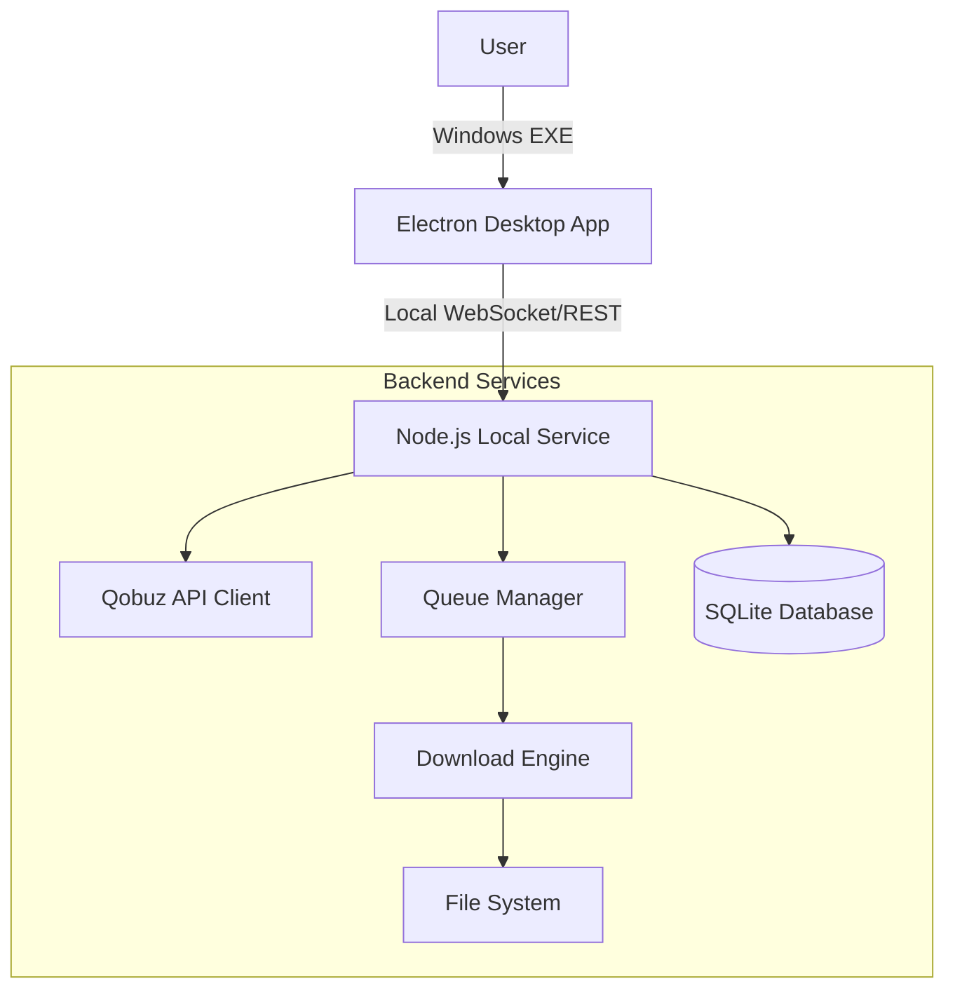
```mermaid
graph TD
    User[User] -->|Windows EXE| Desktop[Electron Desktop App]
    Desktop -->|Local WebSocket/REST| Server[Node.js Local Service]
    
    subgraph Backend Services
        Server --> API[Qobuz API Client]
        Server --> Queue[Queue Manager]
        Server --> DB[(SQLite Database)]
        Queue --> Downloader[Download Engine]
        Downloader --> FS[File System]
    end
```

---

## ⚖️ Legal Disclaimer

**Educational Use Only**
This software is provided specifically for educational and personal archival purposes.

1.  **No Bypass**: This tool does not bypass DRM or region restrictions. It interacts with the API using your own valid credentials.
2.  **Trademarks**: "Qobuz" is a registered trademark of Xandrie SA. This project is not affiliated with Xandrie SA.
3.  **Responsibility**: Users are solely responsible for their actions and must comply with Qobuz's Terms of Service.

---

<div align="center">
  Made with ❤️ by <b>Muhammad Ibnu Fauzi</b>
</div>

