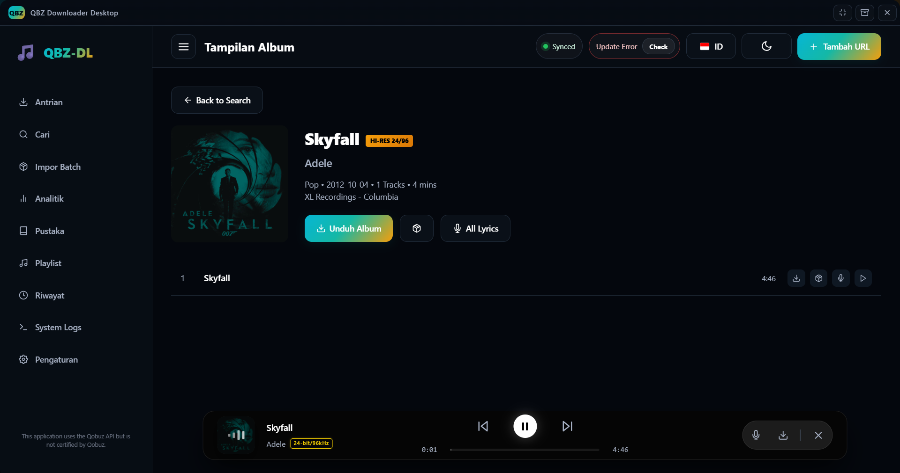
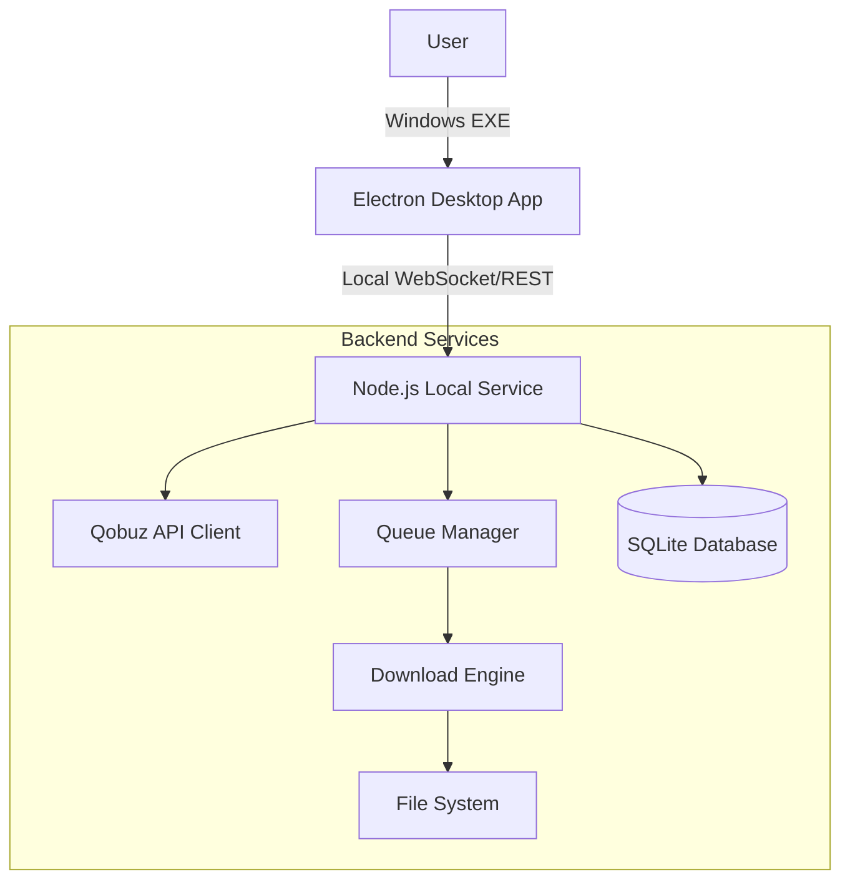

<div align="center">

# 🎵 QBZ-Downloader
### *The Ultimate High-Resolution Audio Downloader & Library Manager*

[](https://github.com/ifauzeee/QBZ-Downloader/releases)
[](https://react.dev/)
[](https://www.typescriptlang.org/)
[](https://nodejs.org/)
[](LICENSE)

<br/>


<br/>

**Unlock the full potential of your music library.**

A comprehensive, enterprise-grade music downloading and library management platform. Experience studio-quality audio up to **24-bit/192kHz** with complete metadata, synchronized lyrics, intelligent queue management, and a stunning real-time desktop dashboard.

[✨ Features](#-key-features) •
[📥 Installation](#-installation) •
[⚙️ Configuration](#-configuration) •
[🖥️ Desktop Mode](#desktop-exe-windows) •
[📸 Screenshots](#-interface-showcase)

</div>

> [!IMPORTANT]
> **This application uses the Qobuz API but is not certified by, endorsed by, or affiliated with Qobuz.**

---

## ✨ Key Features

Everything you need to build the perfect local music library.

| Feature | Description |
| :--- | :--- |
| **🎵 Studio Quality** | Download in **Hi-Res FLAC (up to 24-bit/192kHz)**. Bit-perfect replicas of the source. |
| **🖥️ Modern Dashboard** | Beautiful **React & Vite** interface with **Light/Dark Mode**, real-time updates, and smooth animations. |
| **🎤 Live Lyrics** | Experience synchronized lyrics with **60fps smooth scrolling**. Includes a built-in **Lyrics Editor**. |
| **🏷️ Smart Tagging** | Automatic tagging with **High-Res Cover Art**, Artist, Album, Year, Genre, ISRC, and more. |
| **📦 Batch Power** | Download **Full Albums**, **Artist Discographies**, or **Playlists** with a single click. |
| **📚 Library Manager** | Scans your library to **detect duplicates**, identify missing metadata, and suggest upgrades. |
| **🎼 Visualizer** | Built-in real-time audio visualization for an immersive listening experience. |
| **📊 Analytics** | Visualize your collection with charts: quality distribution, top artists, and storage mastery. |
| **🧩 Desktop-Only Runtime** | Optimized for Windows EXE delivery with local-first configuration and storage. |

---

## 📸 Interface Showcase

Explore the beautiful, functional interface of QBZ-Downloader.

### 🔍 Discovery & Search
Quickly find your music with our optimized search engine.
<div align="center">
  
  
  
</div>

### 👤 Deep Metadata Exploration
Dive into detailed artist biographies and album credits.
<div align="center">
  
  
</div>

### 📥 Download Management
Track your downloads with precision and history.
<div align="center">
  
  
</div>

### 📚 Library Tools
Keep your collection pristine.
<div align="center">
  
  
  
</div>

<div align="center">
  <br/>
  <a href="https://ifauzeee.vercel.app/projects/qbz-downloader/preview">
    
  </a>
</div>

---

## 📥 Installation

### Desktop EXE (Windows)
This project now runs in **desktop-only mode**.
Web/Docker usage has been removed and is no longer supported.



Install ready-to-use EXE directly from GitHub Releases (no clone required):

1. Download EXE from GitHub Releases.
2. Install/run.
3. Fill in your own Qobuz credentials in Settings.

```bash
# 1. Install dependencies
npm install
```

Build commands:

```bash
# Installer only
npm run desktop:dist

# Portable only
npm run desktop:dist:portable

# Both installer + portable
npm run desktop:dist:all
```

Output installer path:
- `release/QBZ-Downloader-Setup-<version>.exe`

Portable output path:
- `release/QBZ-Downloader-Portable-<version>.exe`

Desktop runtime data location:
- Installer build: `%APPDATA%/QBZ Downloader`
- Portable build: `QBZ-Data/` next to the portable executable

First run migration:
- Desktop app automatically migrates `data/qbz.db`, `history.json`, and `settings.json` from your previous project folder when available.

Auto-update (optional):
- Set environment variable `QBZ_UPDATE_URL` to a URL hosting `latest.yml` and installer artifacts.
- Example: `QBZ_UPDATE_URL=https://your-domain.com/qbz-updates/`
- If `QBZ_UPDATE_URL` is not set, desktop app will use GitHub Releases provider from this repository.

Release pipeline (GitHub Actions):
- Push tag with format `v*` to trigger automatic desktop release build and publish.
- Example:

```bash
git tag v4.0.1
git push origin v4.0.1
```

---

## ⚙️ Configuration

All runtime settings are managed from **Desktop Settings** and stored in the **local SQLite database**.

### 🔑 Authentication (Required)
Fill these in Settings:

- `QOBUZ_APP_ID`
- `QOBUZ_APP_SECRET`
- `QOBUZ_USER_AUTH_TOKEN`
- `QOBUZ_USER_ID`

### 📁 Preferences
You can configure directly from Settings UI:

- Download path, folder/file template, concurrency, retry
- Audio quality defaults
- Metadata and lyrics behavior
- Local desktop service port/password

Notes:
- No `.env` file is required for normal desktop usage.
- All credentials and app settings are saved in the local SQLite database via Settings UI.
- Download path changes are applied to new downloads immediately (no app restart required).
- Files downloaded before changing the path stay in the old folder and are not moved automatically.

---

## 🏗️ System Architecture


```mermaid
graph TD
    User[User] -->|Windows EXE| Desktop[Electron Desktop App]
    Desktop -->|Local WebSocket/REST| Server[Node.js Local Service]
    
    subgraph Backend Services
        Server --> API[Qobuz API Client]
        Server --> Queue[Queue Manager]
        Server --> DB[(SQLite Database)]
        Queue --> Downloader[Download Engine]
        Downloader --> FS[File System]
    end
```

---

## ⚖️ Legal Disclaimer

**Educational Use Only**
This software is provided specifically for educational and personal archival purposes.

1.  **No Bypass**: This tool does not bypass DRM or region restrictions. It interacts with the API using your own valid credentials.
2.  **Trademarks**: "Qobuz" is a registered trademark of Xandrie SA. This project is not affiliated with Xandrie SA.
3.  **Responsibility**: Users are solely responsible for their actions and must comply with Qobuz's Terms of Service.

---

<div align="center">
  Made with ❤️ by <b>Muhammad Ibnu Fauzi</b>
</div>
