<div align="center">

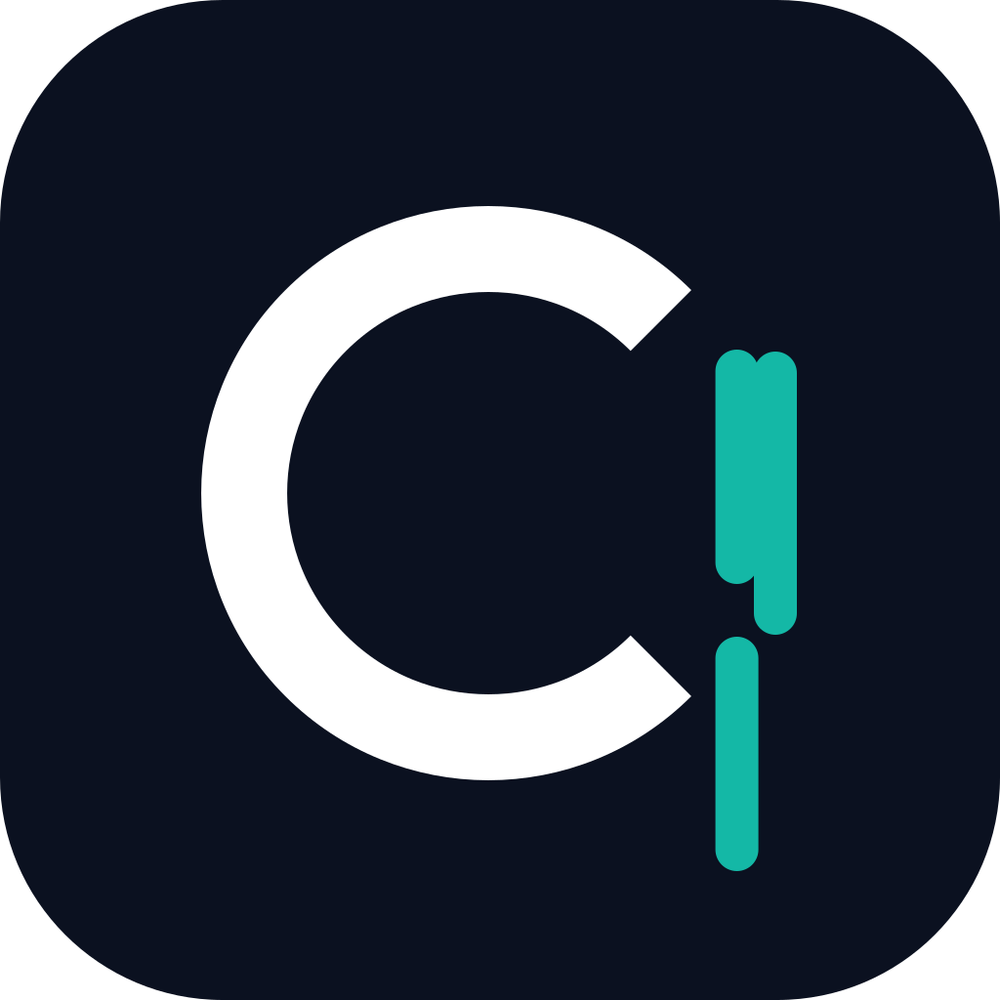

# 🎵 QBZ-Downloader
### The Ultimate High-Resolution Audio Downloader & Library Manager

[](https://github.com/ifauzeee/QBZ-Downloader/releases)
[](https://github.com/ifauzeee/QBZ-Downloader/releases/latest)
[](https://github.com/ifauzeee/QBZ-Downloader/releases/latest)
[](https://github.com/ifauzeee/QBZ-Downloader/releases/latest)
[](https://github.com/ifauzeee/QBZ-Downloader/pkgs/container/qbz-downloader)
[](https://buymeacoffee.com/ifauzeee)

[](https://react.dev/)
[](https://www.typescriptlang.org/)
[](https://nodejs.org/)
[](https://www.electronjs.org/)
[](LICENSE)

<br/>

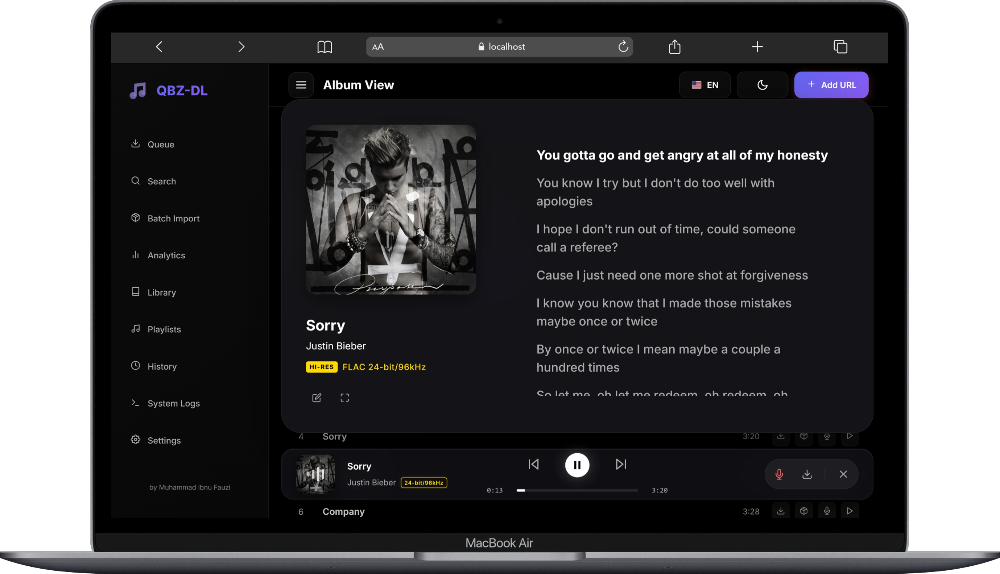

<br/>

**QBZ-Downloader** is a cross-platform desktop application for building and managing a personal high-resolution music library. It downloads studio-quality audio up to **24-bit / 192 kHz** from Qobuz, enriches every track with complete metadata and synchronized lyrics, and provides a beautiful dashboard for queue management, library analytics, and day-to-day listening.

[✨ Features](#-key-features) •
[📥 Installation](#-installation) •
[🐳 Docker](#docker-for-nas--headless-servers) •
[🤝 Contributors](#-contributors)

</div>

---

## ✨ Key Features

QBZ-Downloader transforms the way you curate your local music library. Every feature is designed to deliver a seamless, high-fidelity experience from search to playback.

| Feature | Description |
|:-------|:------------|
| **🎵 Studio-Quality Downloads** | Download tracks in pristine FLAC format at resolutions up to 24-bit / 192 kHz. Every file is a bit-perfect replica of the original studio master. |
| **🖥️ Modern Desktop Dashboard** | A polished React and Vite interface greets you with light and dark themes, real-time progress updates, smooth animations, and an intuitive layout that feels right at home on any platform. |
| **🎤 Synchronized Lyrics** | Experience live lyrics that scroll at 60 fps in perfect sync with the music. A built-in lyrics editor lets you correct or customize the text on the fly. |
| **🏷️ Intelligent Metadata Tagging** | Every downloaded track is automatically tagged with high-resolution cover art, artist name, album title, release year, genre, ISRC, and more — so your library is always organised and ready for any player. |
| **📦 Batch Operations** | Download entire albums, complete artist discographies, or full playlists in a single click. The queue manager handles prioritisation, concurrency, and error recovery automatically. |
| **📚 Library Manager** | Scan your existing collection to detect duplicates, surface missing metadata, identify format quality, and suggest Hi-Res upgrade candidates with visual release-picker comparisons. |
| **🎼 Audio Visualizer** | A real-time audio visualisation engine turns your listening sessions into an immersive visual experience directly within the dashboard. |
| **📊 Library Analytics** | Gain insight into your collection with interactive charts covering quality distribution, top artists, storage usage trends, and more. |
| **🔄 Resumable Downloads** | Interrupted transfers recover automatically. The download engine supports HTTP Range requests so a partial file picks up exactly where it left off. |
| **🔌 Bandwidth Control** | Limit the download speed to keep bandwidth available for other activities on your network. |
| **🔐 Encrypted Credentials** | Qobuz authentication tokens and secrets are encrypted before they touch the local database, keeping your account information secure. |
| **🌍 Spotify Import** | Migrate your existing playlists from Spotify directly into Qobuz, then download the matching tracks in high resolution — no manual searching required. |
| **🔍 Quality Analysis** | A built-in spectral scanner detects upsampled or fake lossless files, so you always know the true provenance of your audio. |
| **📡 Media Server Integration** | After a download completes, the app can automatically notify Plex or Jellyfin to rescan the library — your music appears in your media server immediately. |
| **📤 Automatic Format Conversion** | Optionally convert downloaded FLAC files to MP3, AAC, or Opus for portable devices. The conversion runs automatically after every download. |
| **👀 Playlist Watcher** | Subscribe to any Qobuz playlist and the app will monitor it for new tracks, downloading them as soon as they appear. |
| **🐳 Docker Deployment** | Run the full dashboard inside a container on your NAS or headless server. A multi-architecture image (amd64 + arm64) is published to GHCR with every release. |

---

## 📸 Interface Showcase

### Discovery and Search
Find any album, artist, or track with the built-in search engine.

<div align="center">
  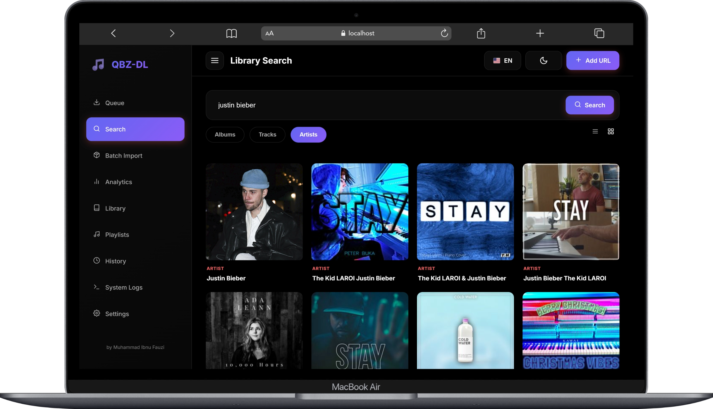
  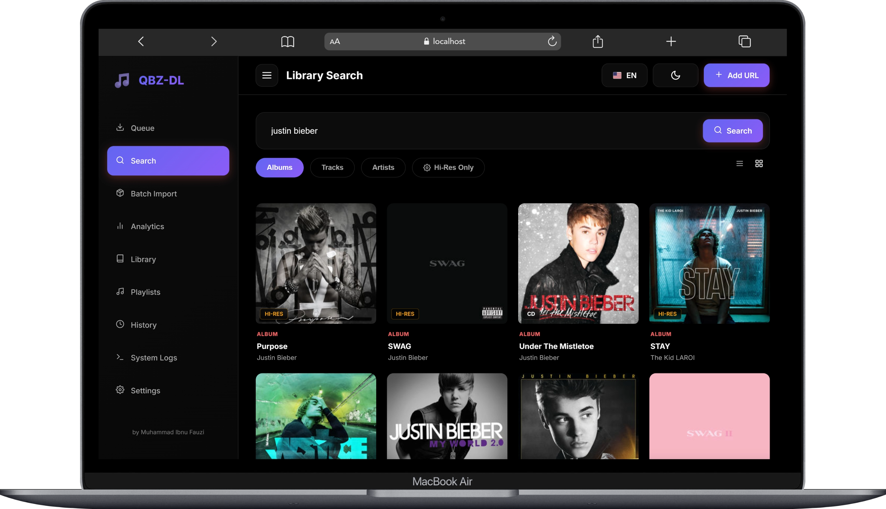
  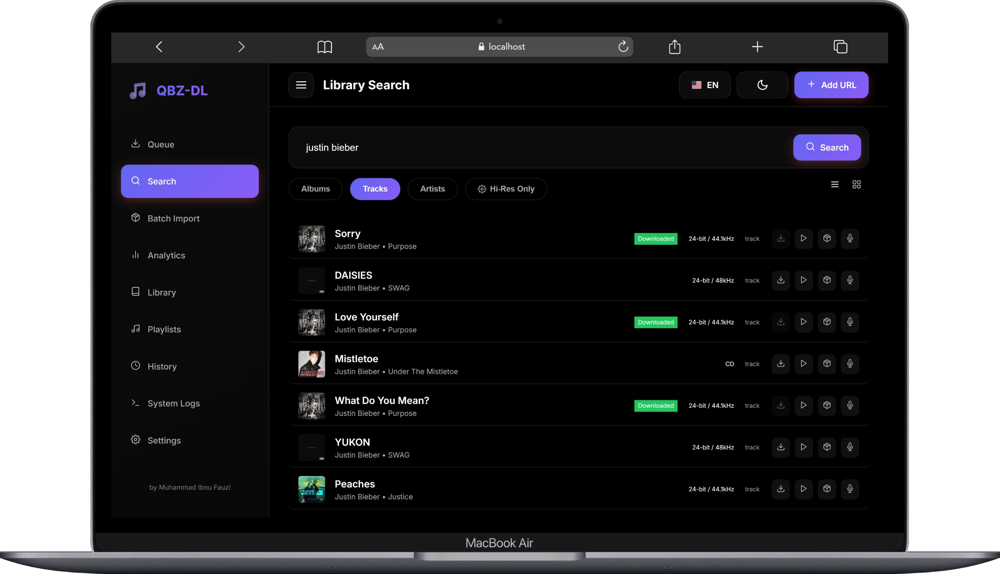
</div>

### Artist and Album Details
Dive into detailed biographies and full album credits with cover art, track listing, and release information.

<div align="center">
  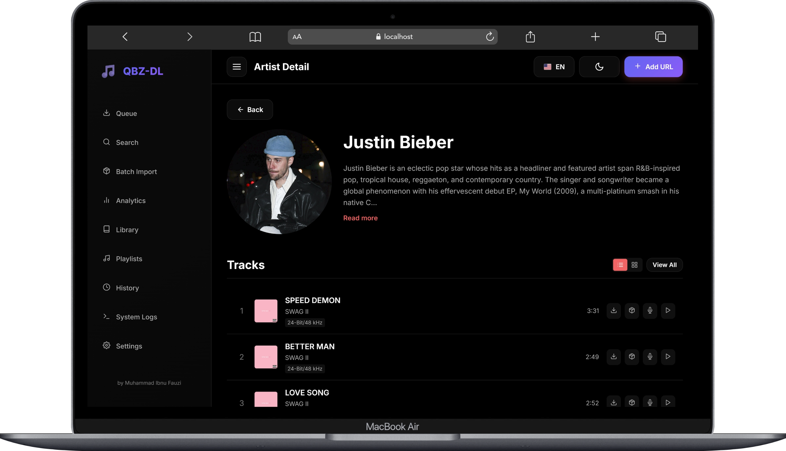
  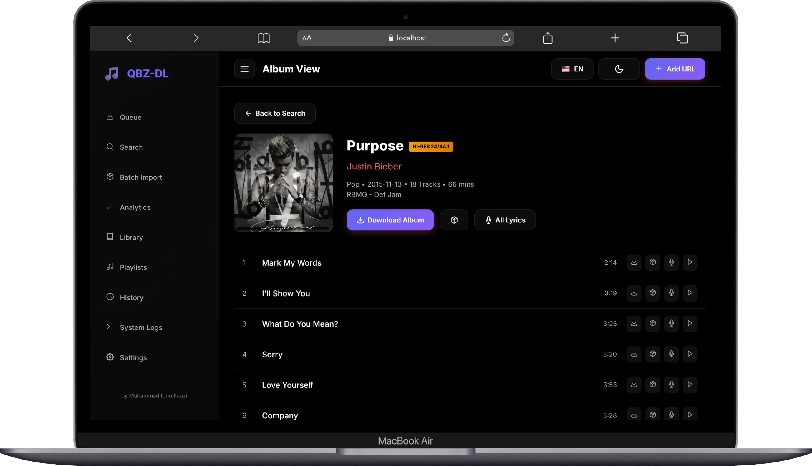
</div>

### Download Queue and History
Monitor active downloads, reorder queued items, and review your complete download history.

<div align="center">
  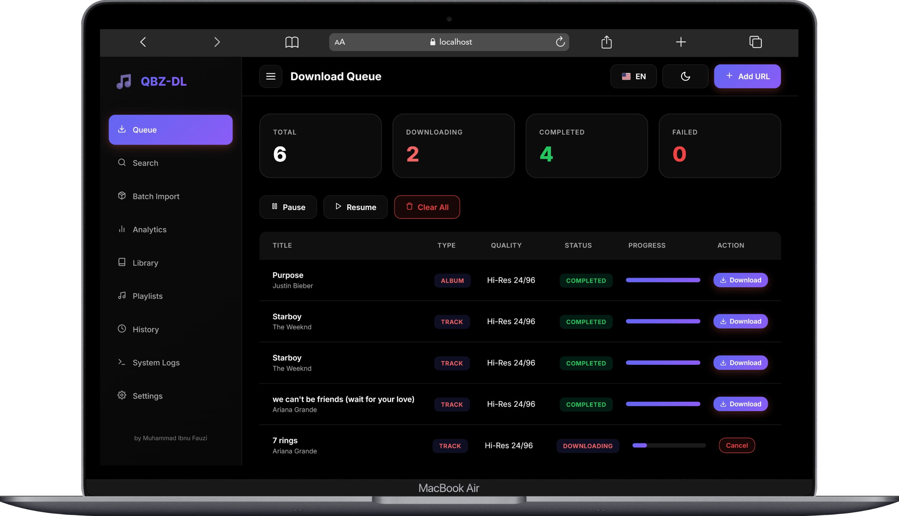
  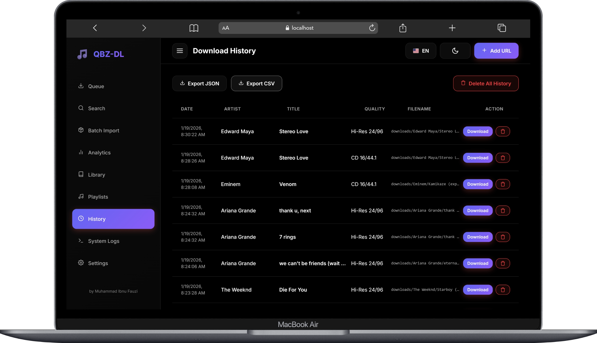
</div>

### Library Management Tools
Audit your collection for metadata completeness, identify Hi-Res upgrade candidates, and explore your listening statistics.

<div align="center">
  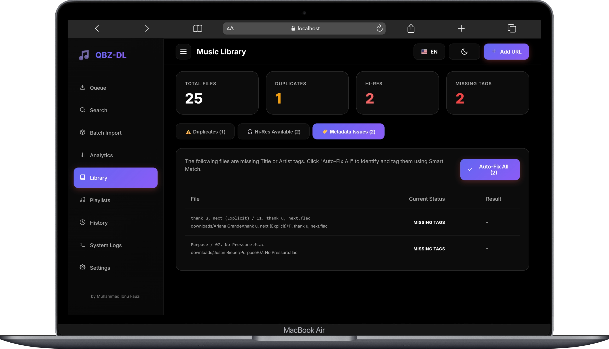
  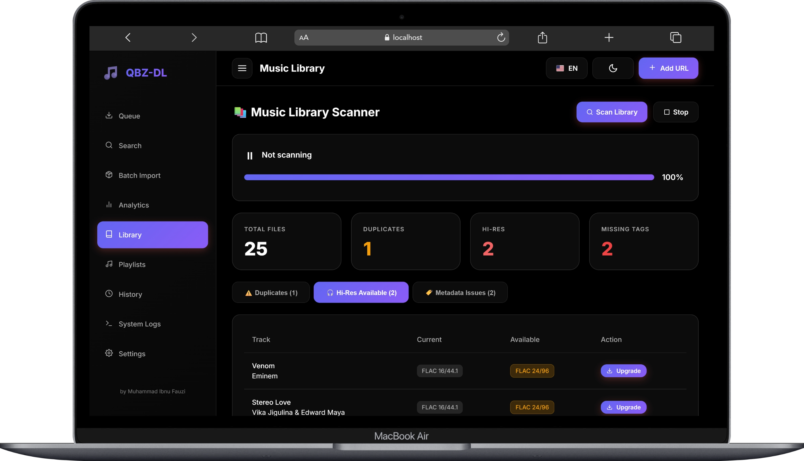
  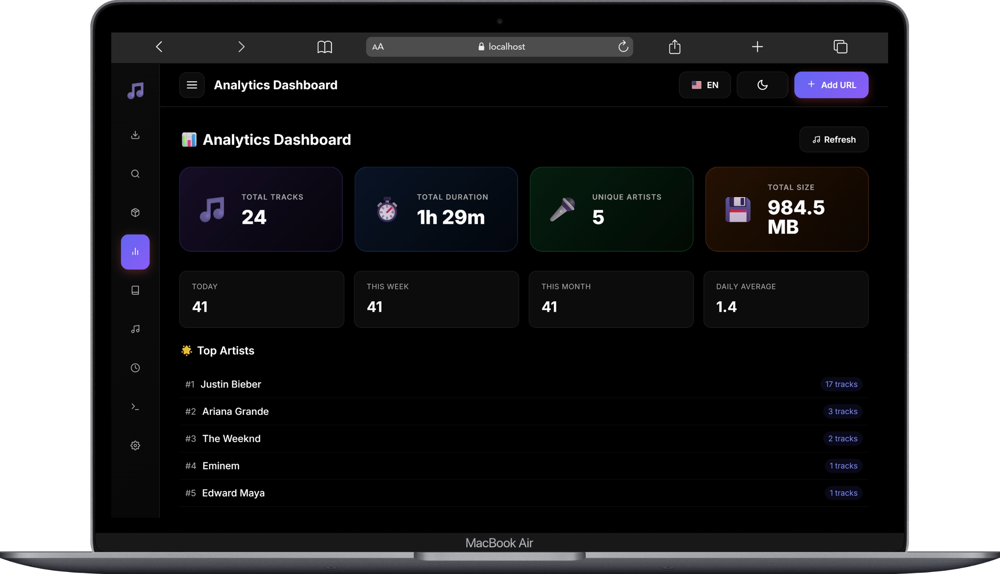
</div>

<div align="center">
  <br/>
  <a href="https://ifauzeee.vercel.app/projects/qbz-downloader/preview">
    
  </a>
</div>

---

## 📥 Installation

### Desktop Application (Windows, macOS, Linux)
QBZ-Downloader ships as a native desktop application for all three major platforms. Download the installer for your operating system from the [Releases page](https://github.com/ifauzeee/QBZ-Downloader/releases/latest), run it, and complete the one-time credential setup in the settings panel.

- **Windows:** `.exe` installer or portable `.exe` (no installation required)
- **macOS:** `.dmg` disk image for Apple Silicon (arm64); Intel support is planned for a future release
- **Linux:** `.AppImage` (portable), `.deb` (Debian / Ubuntu), or `.tar.gz` archive

### Build from Source
If you prefer to build the application yourself:

```bash
# Install dependencies
npm install

# Build both the client dashboard and the backend server
npm run build:full

# Package the desktop installer
npm run desktop:dist
```

Build artifacts are written to the `release/` directory:
- **Windows:** `QBZ-Downloader-Setup-<version>.exe` and `QBZ-Downloader-Portable-<version>.exe`
- **macOS:** `QBZ-Downloader-<version>-arm64.dmg`
- **Linux:** `QBZ-Downloader-<version>-x86_64.AppImage`, `.deb`, and `.tar.gz`

### Pre-Release Builds (CI Artifacts)
When a fix has been merged to `main` but a formal release has not yet been cut, you can download the latest CI build directly from GitHub Actions:

1. Navigate to the [Actions tab](https://github.com/ifauzeee/QBZ-Downloader/actions) and select the **Desktop Release** workflow.
2. Open the latest green-checkmarked run.
3. Scroll down to the **Artifacts** section and download your platform's bundle:
   - `Windows-Installer` — the `.exe` installer
   - `macOS-DMG` — the `.dmg` disk image
   - `Linux-AppImage` — the portable `.AppImage`
4. Extract the archive and run the installer. No build tools are required.

> These builds are compiled from the latest `main` branch using the same CI pipeline that produces official releases. They are functionally identical to a tagged release — the only difference is the absence of a version tag.

### Docker (for NAS / Headless Servers)
A pre-built multi-architecture Docker image is available for server and NAS deployments. It bundles ffmpeg, fpcalc, and the full dashboard behind a password-protected web interface.

```bash
docker pull ghcr.io/ifauzeee/qbz-downloader:latest
```

Refer to the [Docker workflow](.github/workflows/docker-publish.yml) for environment variables and volume mount points.

---

## ⚙️ Configuration

All application settings are managed through the dashboard's **Settings** interface and persisted in a local SQLite database. No manual `.env` files or configuration edits are required.

### Authentication
Before you can download music, you must provide your Qobuz credentials in the Settings panel:

- `QOBUZ_APP_ID`
- `QOBUZ_APP_SECRET`
- `QOBUZ_USER_AUTH_TOKEN`
- `QOBUZ_USER_ID`

Sensitive values are encrypted before storage. Application data is kept in your platform's standard data directory:

| Platform | Data Directory |
|----------|---------------|
| **Windows** | `%APPDATA%/QBZ Downloader/` |
| **macOS** | `~/Library/Application Support/QBZ Downloader/` |
| **Linux** | `~/.local/share/QBZ Downloader/` |

---

## 🏗️ System Architecture

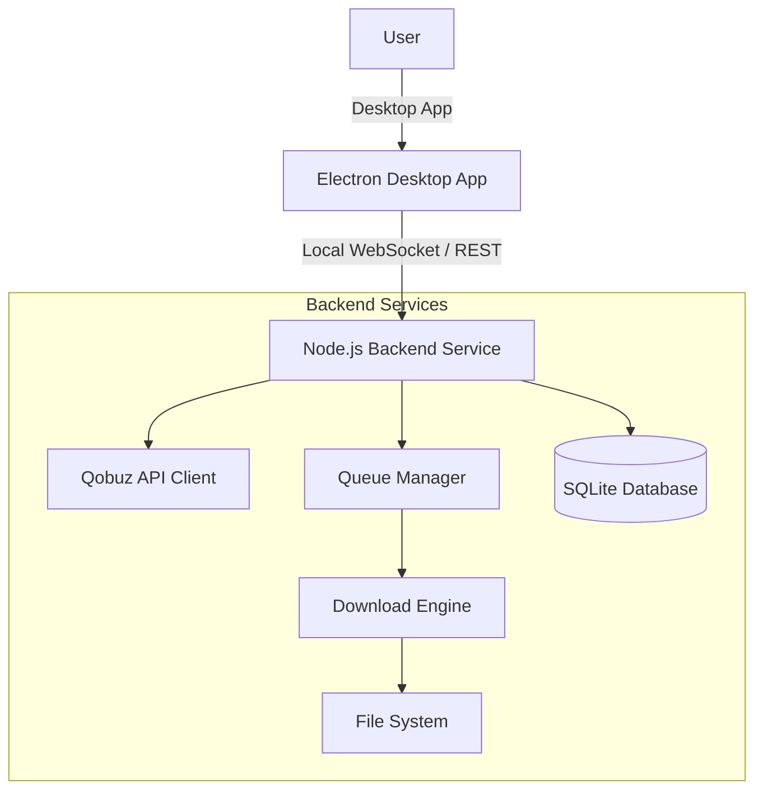
```mermaid
graph TD
    User[User] -->|Desktop App| Desktop[Electron Desktop App]
    Desktop -->|Local WebSocket / REST| Server[Node.js Backend Service]

    subgraph Backend Services
        Server --> API[Qobuz API Client]
        Server --> Queue[Queue Manager]
        Server --> DB[(SQLite Database)]
        Queue --> Downloader[Download Engine]
        Downloader --> FS[File System]
    end
```

The application follows a local-first architecture. An Electron shell wraps a Node.js backend that communicates with the React dashboard over WebSocket and REST. The backend handles all Qobuz API interactions, queue processing, metadata tagging, and library scanning against a local SQLite database.

---

## 🤝 Contributors

QBZ-Downloader is developed and maintained by **Muhammad Ibnu Fauzi**, with valuable contributions from the community.

<a href="https://github.com/ifauzeee">
  
</a>
<a href="https://github.com/ICHlMOKU">
  
</a>

| Contributor | Role |
|:------------|:-----|
| [@ifauzeee](https://github.com/ifauzeee) | Project maintainer, core development, architecture |
| [@ICHlMOKU](https://github.com/ICHlMOKU) | Docker CI/CD, cross-platform FLAC tagging fix, security hardening, path traversal protection, Unraid template, media route authentication, environment variable handling, HTTP login fix |
| [@dependabot](https://github.com/dependabot) | Automated dependency management and security updates |

We welcome contributions of all kinds — bug reports, feature suggestions, documentation improvements, and pull requests.

---

## ⚖️ Legal Disclaimer

**Educational and Personal Archival Use Only.** This software is provided for educational purposes and personal archival use.

1. **No DRM circumvention.** QBZ-Downloader does not bypass DRM or region restrictions. It interacts with the Qobuz API using your own valid credentials.
2. **Trademark notice.** "Qobuz" is a registered trademark of Xandrie SA. This project is not affiliated with, endorsed by, or sponsored by Xandrie SA or Qobuz.
3. **User responsibility.** You are solely responsible for how you use this software. Please comply with Qobuz's Terms of Service at all times.

---

<div align="center">
  Made with ❤️ by <b>Muhammad Ibnu Fauzi</b> &nbsp;·&nbsp;
  <a href="https://github.com/ifauzeee/QBZ-Downloader"><b>GitHub</b></a>
</div>
