<div align="center">

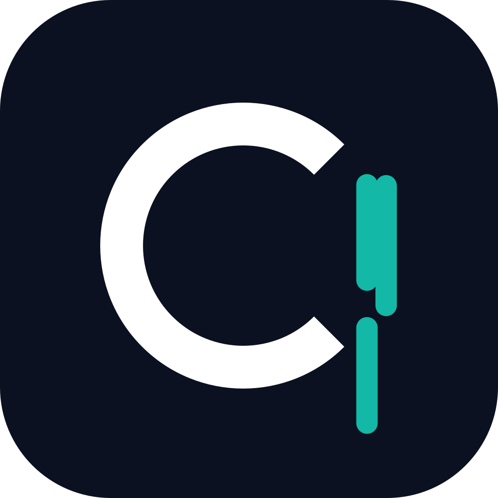

# 🎵 QBZ-Downloader
### The Ultimate High-Resolution Audio Downloader & Library Manager

[](https://github.com/ifauzeee/QBZ-Downloader)

[](https://react.dev/)
[](https://www.typescriptlang.org/)
[](https://nodejs.org/)
[](https://www.electronjs.org/)
[](LICENSE)

<br/>

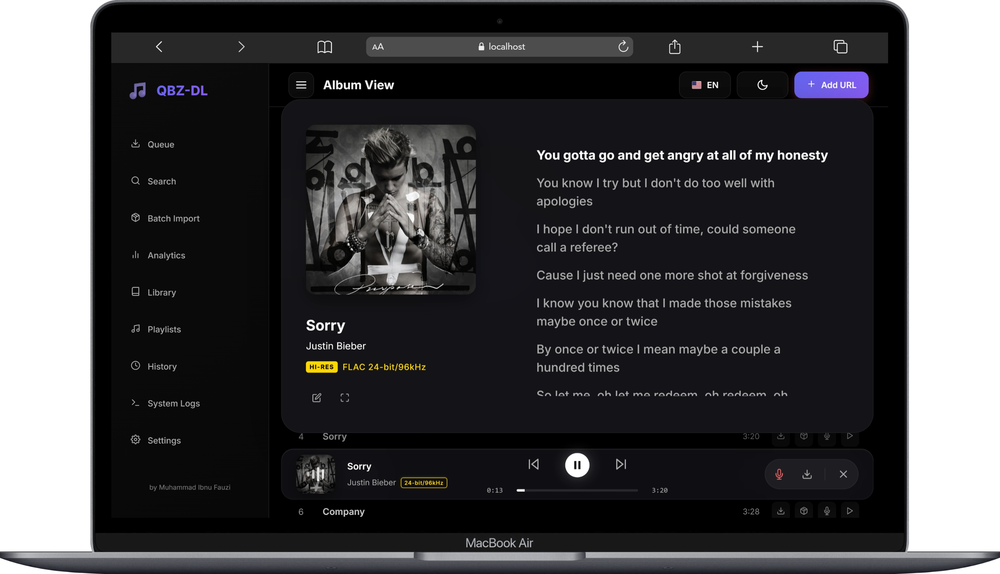

<br/>

**QBZ-Downloader** is a cross-platform desktop application for building and managing a personal high-resolution music library. It downloads studio-quality audio up to **24-bit / 192 kHz** from Qobuz, enriches every track with complete metadata and synchronized lyrics, and provides a beautiful dashboard for queue management, library analytics, and day-to-day listening.

[✨ Features](#-key-features) •
[📥 Installation](#-installation) •
[🤝 Contributors](#-contributors)

</div>

---

## ✨ Key Features

QBZ-Downloader transforms the way you curate your local music library. Every feature is designed to deliver a seamless, high-fidelity experience from search to playback.

| Feature | Description |
|:-------|:------------|
| **🎵 Studio-Quality Downloads** | Download tracks in pristine FLAC format at resolutions up to 24-bit / 192 kHz. Every file is a bit-perfect replica of the original studio master. |
| **🖥️ Modern Desktop Dashboard** | A polished React and Vite interface greets you with light and dark themes, real-time progress updates, smooth animations, and an intuitive layout that feels right at home on any platform. |
| **🎤 Synchronized Lyrics** | Experience live lyrics that scroll at 60 fps in perfect sync with the music. A built-in lyrics editor lets you correct or customize the text on the fly. |
| **🏷️ Intelligent Metadata Tagging** | Every downloaded track is automatically tagged with high-resolution cover art, artist name, album title, release year, genre, ISRC, and more — so your library is always organised and ready for any player. |
| **📦 Batch Operations** | Download entire albums, complete artist discographies, or full playlists in a single click. The queue manager handles prioritisation, concurrency, and error recovery automatically. |
| **📚 Library Manager** | Scan your existing collection to detect duplicates, surface missing metadata, identify format quality, and suggest Hi-Res upgrade candidates with visual release-picker comparisons. |
| **🎼 Audio Visualizer** | A real-time audio visualisation engine turns your listening sessions into an immersive visual experience directly within the dashboard. |
| **📊 Library Analytics** | Gain insight into your collection with interactive charts covering quality distribution, top artists, storage usage trends, and more. |
| **🔄 Resumable Downloads** | Interrupted transfers recover automatically. The download engine supports HTTP Range requests so a partial file picks up exactly where it left off. |
| **🔌 Bandwidth Control** | Limit the download speed to keep bandwidth available for other activities on your network. |
| **🔐 Encrypted Credentials** | Qobuz authentication tokens and secrets are encrypted before they touch the local database, keeping your account information secure. |
| **🌍 Spotify Import** | Migrate your existing playlists from Spotify directly into Qobuz, then download the matching tracks in high resolution — no manual searching required. |
| **🔍 Quality Analysis** | A built-in spectral scanner detects upsampled or fake lossless files, so you always know the true provenance of your audio. |
| **📡 Media Server Integration** | After a download completes, the app can automatically notify Plex or Jellyfin to rescan the library — your music appears in your media server immediately. |
| **📤 Automatic Format Conversion** | Optionally convert downloaded FLAC files to MP3, AAC, or Opus for portable devices. The conversion runs automatically after every download. |
| **👀 Playlist Watcher** | Subscribe to any Qobuz playlist and the app will monitor it for new tracks, downloading them as soon as they appear. |

---

## 📸 Interface Showcase

### Discovery and Search
Find any album, artist, or track with the built-in search engine.

<div align="center">
  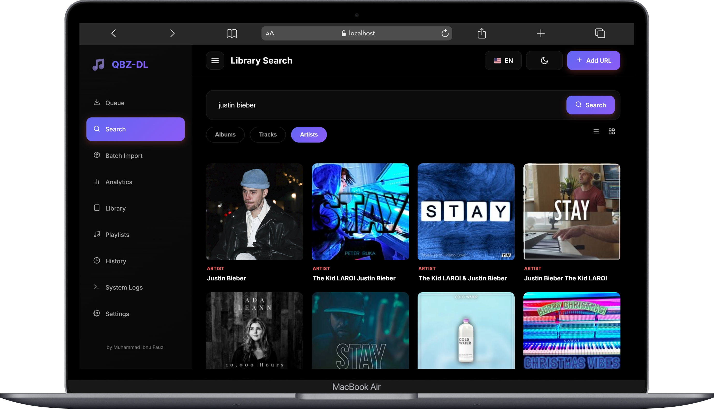
  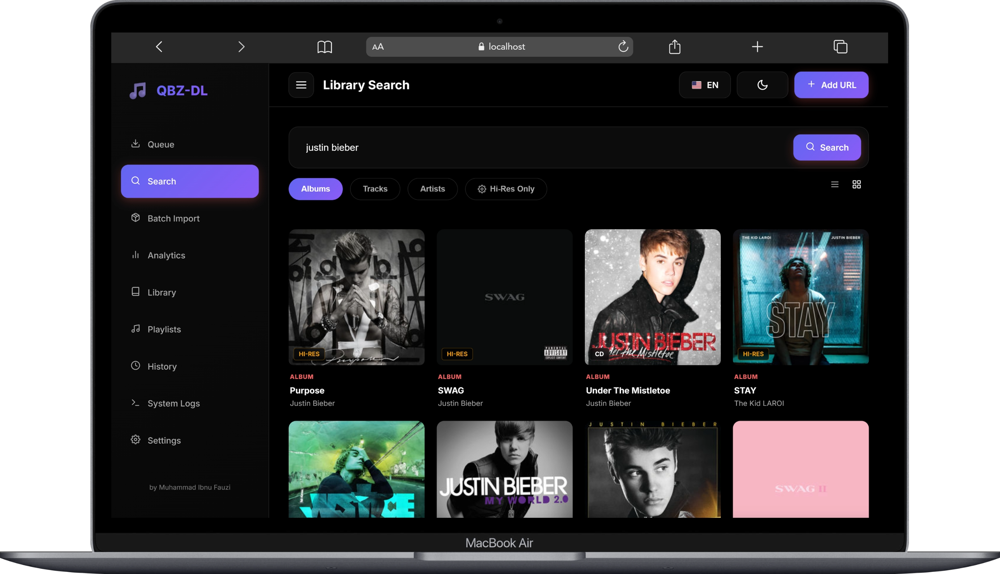
  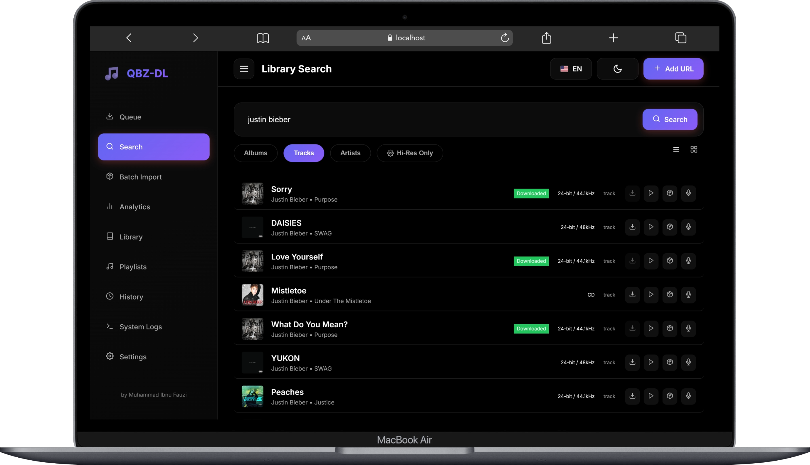
</div>

### Artist and Album Details
Dive into detailed biographies and full album credits with cover art, track listing, and release information.

<div align="center">
  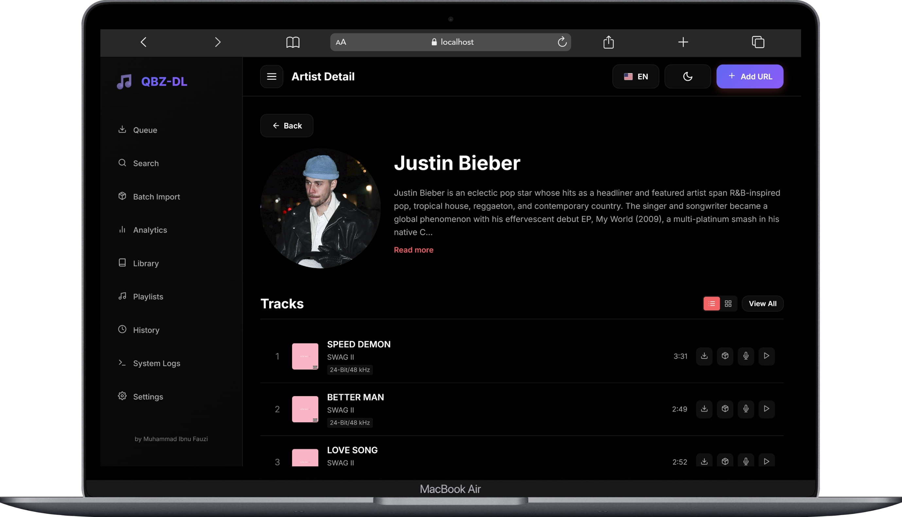
  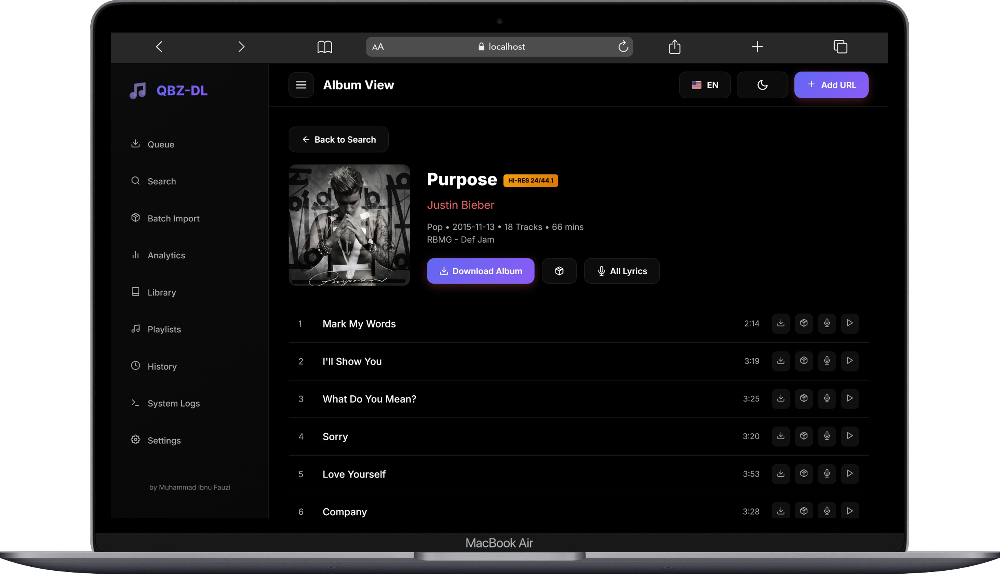
</div>

### Download Queue and History
Monitor active downloads, reorder queued items, and review your complete download history.

<div align="center">
  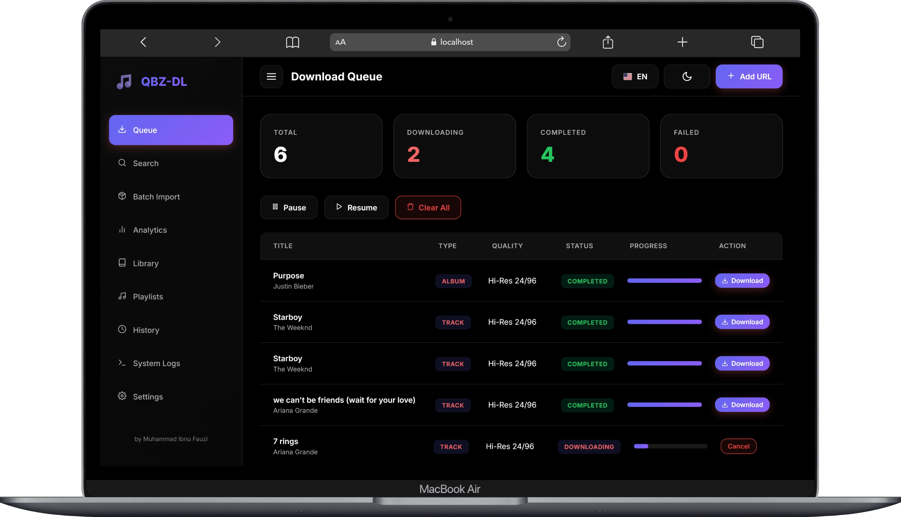
  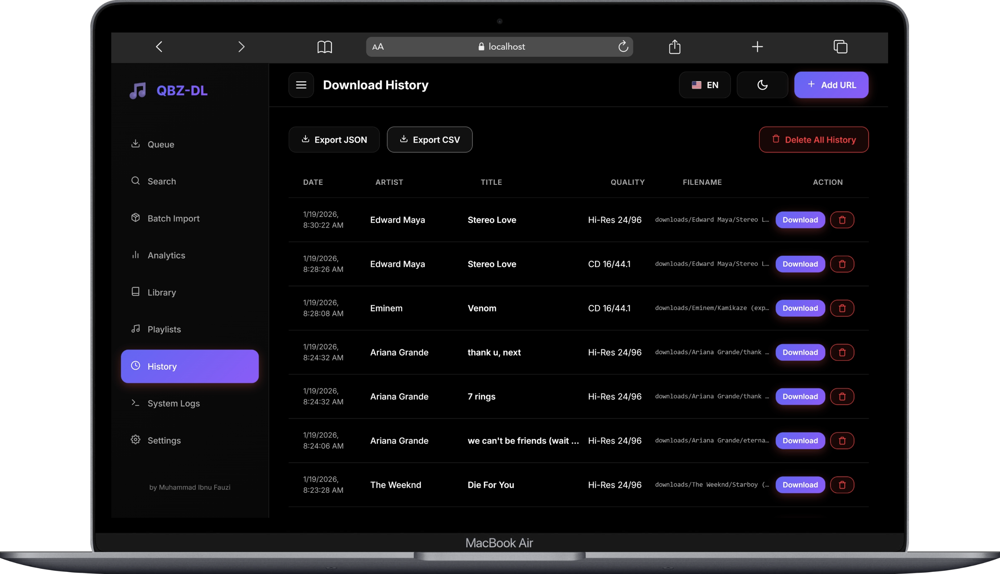
</div>

### Library Management Tools
Audit your collection for metadata completeness, identify Hi-Res upgrade candidates, and explore your listening statistics.

<div align="center">
  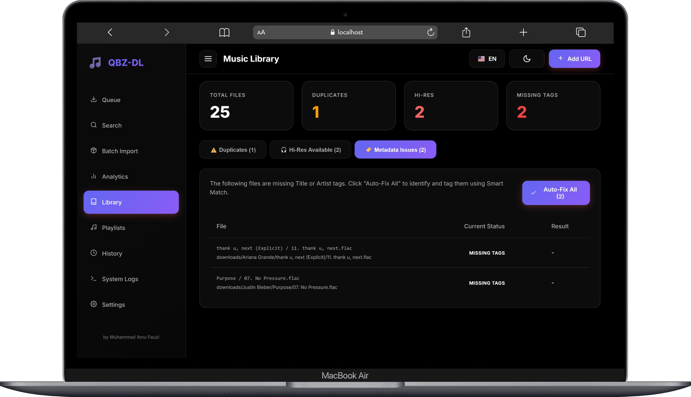
  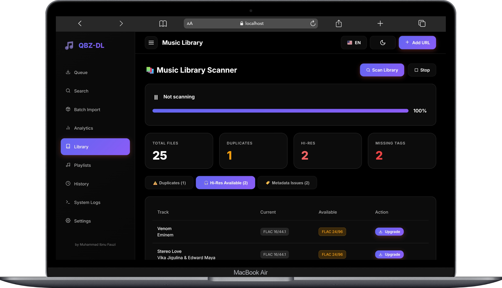
  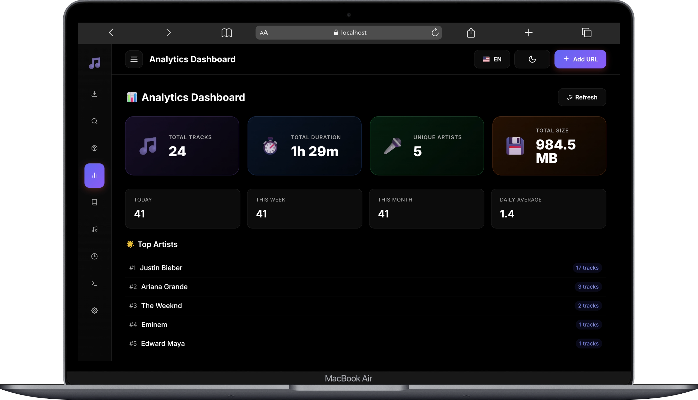
</div>

<div align="center">
  <br/>
  <a href="https://ifauzeee.vercel.app/projects/qbz-downloader/preview">
    
  </a>
</div>

---

## 📥 Installation

There are no prebuilt installers or container images. Build from source and
run it locally.

### Build from Source

```bash
# Install dependencies
npm install

# Build both the client dashboard and the backend server
npm run build:full
```

Run the desktop app in development:

```bash
npm run desktop:start
```

`desktop:start` rebuilds `better-sqlite3` for Electron, starts the Electron
shell, and loads the local dashboard.

The dashboard also runs as a plain Node service, without Electron:

```bash
npm run build
npm start
```

Build artifacts are written to the `dist/` directory.

---

## ⚙️ Configuration

All application settings are managed through the dashboard's **Settings** interface and persisted in a local SQLite database. No manual `.env` files or configuration edits are required.

### Authentication
Before you can download music, you must provide your Qobuz credentials in the Settings panel:

- `QOBUZ_APP_ID`
- `QOBUZ_APP_SECRET`
- `QOBUZ_USER_AUTH_TOKEN`
- `QOBUZ_USER_ID`

Sensitive values are encrypted before storage. Application data is kept in your platform's standard data directory:

| Platform | Data Directory |
|----------|---------------|
| **Windows** | `%APPDATA%/QBZ Downloader/` |
| **macOS** | `~/Library/Application Support/QBZ Downloader/` |
| **Linux** | `~/.local/share/QBZ Downloader/` |

---

## 🏗️ System Architecture

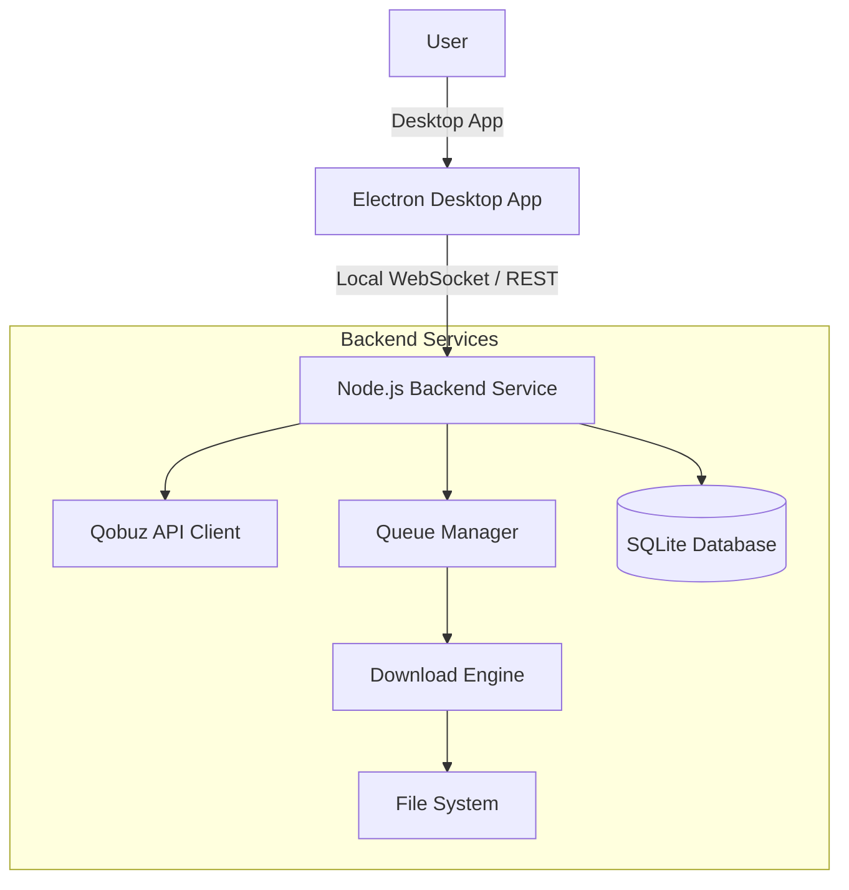
```mermaid
graph TD
    User[User] -->|Desktop App| Desktop[Electron Desktop App]
    Desktop -->|Local WebSocket / REST| Server[Node.js Backend Service]

    subgraph Backend Services
        Server --> API[Qobuz API Client]
        Server --> Queue[Queue Manager]
        Server --> DB[(SQLite Database)]
        Queue --> Downloader[Download Engine]
        Downloader --> FS[File System]
    end
```

The application follows a local-first architecture. An Electron shell wraps a Node.js backend that communicates with the React dashboard over WebSocket and REST. The backend handles all Qobuz API interactions, queue processing, metadata tagging, and library scanning against a local SQLite database.

---

## 🤝 Contributors

QBZ-Downloader is developed and maintained by **Muhammad Ibnu Fauzi**, with valuable contributions from the community.

<a href="https://github.com/ifauzeee">
  
</a>
<a href="https://github.com/ICHlMOKU">
  
</a>
<a href="https://github.com/MiguelGalrao">
  
</a>

| Contributor | Role |
|:------------|:-----|
| [@ifauzeee](https://github.com/ifauzeee) | Project maintainer, core development, architecture |
| [@ICHlMOKU](https://github.com/ICHlMOKU) | Docker CI/CD, cross-platform FLAC tagging fix, security hardening, path traversal protection, Unraid template, media route authentication, environment variable handling, HTTP login fix |
| [@MiguelGalrao](https://github.com/MiguelGalrao) | macOS ad-hoc signing fix for "app is damaged" on Apple Silicon (issue #107), download engine bug fixes (partial files, skipExisting, empty zips, queue concurrency), dashboard security hardening |
| [@dependabot](https://github.com/dependabot) | Automated dependency management and security updates |

We welcome contributions of all kinds — bug reports, feature suggestions, documentation improvements, and pull requests.

---

## ⚖️ Legal Disclaimer

**Personal archival use only.** This software is intended for educational purposes and for managing a personal music library built from content you have legitimately licensed or purchased.

1. **Your own subscription required.** QBZ-Downloader uses your own Qobuz account credentials. An active paid Qobuz subscription is required to download content — it is not a tool for free access.
2. **Access outside the official flow.** The application talks to the Qobuz API directly instead of using Qobuz's official download feature. That access is not authorized by Qobuz and is prohibited by their [Terms of Service](https://www.qobuz.com/terms-of-use), so accounts used with this tool may be suspended or terminated.
3. **Copyright.** Every file obtained through this software is protected by copyright. Do not copy, share, redistribute, or publicly perform them. The rules for keeping a personal backup copy differ by country, and respecting them is your responsibility.
4. **No affiliation or endorsement.** "Qobuz" is a registered trademark of Xandrie SA. This project is not affiliated with, endorsed by, or sponsored by Xandrie SA or Qobuz.
5. **No warranty.** The software is provided "as is", without warranty of any kind. The authors accept no liability for damages, data loss, account termination, or legal consequences arising from its use.
6. **Not legal advice.** Nothing in this document is legal advice. If you are unsure about your situation, consult a qualified lawyer in your jurisdiction.

---

<div align="center">
  Made with ❤️ by <b>Muhammad Ibnu Fauzi</b> &nbsp;·&nbsp;
  <a href="https://github.com/ifauzeee/QBZ-Downloader"><b>GitHub</b></a>
</div>
